La programación orientada a objetos tiene cuatro características principales:

Encapsulamiento. Quiere decir que oculta datos mediante código.
Abstracción. Es como se pueden representar los objetos en modo de código.
Herencia. Es donde una clase nueva se crea a partir de una clase existente.
Polimorfismo. Se refiere a la propiedad por la que es posible enviar mensajes sintácticamente iguales a objetos de tipos distintos.

¿Qué resuelve la Programación Orientada a Objetos?

Codigo muy largo vs programacion estructurada

Huecos que la programación estructurada no resuelve, por lo que la estructuración por objetos surgió como una solución.

Ayuda a leer, depurar y mantener código que puede ser muy largo.
Evita que todo se rompa si algo falla.
Facilita el mantenimiento del código.
Evita generar un código espaguetti. Aquél que tiene demasiadas sentencias de control anidadas.

"Paradigma Orientado a Objetos"
POO o OOP, viene de una manera de pensar llamada “orientación a objetos”.
Surge a partir de los problemas que tenemos y necesitamos plasmar en código.
Observar los problemas en forma de objetos.
Paradigma: Teoría que suministra la base y modelo para resolver problemas.
La OO es un paradigma de programación programación a objetos:
Veremos: Clases, propiedadades, métodos, objetos
Encapsulamiento, Abstracción, Herencia, Polimorfismo

--“Lenguajes Orientados a Objetos”
En POO tenemos los siguientes lenguaje: Java, PHP, Python, JavaScript, C#, Ruby, Kotlin.
-Java:
-Orientado a objetos naturalmente.
-Android.
-Server side.
-Archivos .java
-PHP:
-Lenguaje interpretado.
-Pensado para la web.
-Archivos .php
-Python:
-Diseñado para ser fácil de usar.
-Múltiples usos: Web, Server Side, Análisis de Datos, Machine Learning, etc.
-Archivo .py
-JavaScript:
-Lenguaje interpretado.
-Orientado a Objetos pero basado en prototipos.
-Pensado para la Web.
-Archivos .js

-- “Diagramas de Modelado”
https://es.slideshare.net/still01/aprendiendo-uml-en-24-horas-16815956

Vamos a ver algunos diagramas de modelado:
OMT: Object Modeling Techniques, una vez que tenemos nuestro análisis, nuestros objetos,
atributos, métodos, inclusive objetos con nombres, empecemos a plasmar cada objeto en un
recuadro y pongamos todos los atributos y los métodos y con conectores definamos la relación
que tienen uno con otro.
UML: Unified Modeling Language, es más moderno, tomó las bases de la OMT y generó una mejor versión.

Se pueden realizar los siguientes modelos:
Clases, casos de uso, objetos, actividades, iteración, estados, implementación

Como ya viste UML significa Unified Modeling Language el cual es un lenguaje estándar de modelado de sistemas orientados a objetos.

Esto significa que tendremos una manera gráfica de representar una situación, justo como hemos venido viendo. A continuación te voy a presentar los elementos que puedes utilizar para hacer estas representaciones.

Las clases se representan así:

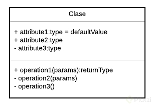

En la parte superior se colocan los atributos o propiedades, y debajo las opera ciones de la clase. Notarás que el primer caracter con el que empiezan es un símbolo. Este denotará la visibilidad del atributo o método, esto es un término que tiene que ver con Encapsulamiento y veremos más adelante a detalle.

Estos son los niveles de visibilidad que puedes tener:

- private
+ public
# protected
~ default

Una forma de representar las relaciones que tendrá un elemento con otro es a través de las flechas en UML, y aquí tenemos varios tipos, estos son los más comunes:

Asociación

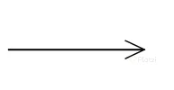

Como su nombre lo dice, notarás que cada vez que esté referenciada este tipo de flecha significará que ese elemento contiene al otro en su definición. La flecha apuntará hacia la dependencia.

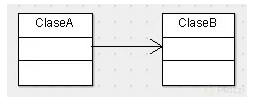

Con esto vemos que la ClaseA está asociada y depende de la ClaseB.
Herencia

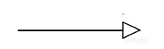

Siempre que veamos este tipo de flecha se estará expresando la herencia.
La dirección de la flecha irá desde el hijo hasta el padre.

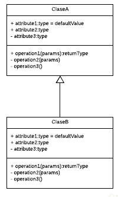

Con esto vemos que la ClaseB hereda de la ClaseA

Agregación

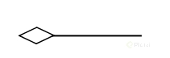

Este se parece a la asociación en que un elemento dependerá del otro, pero en este caso será: Un elemento dependerá de muchos otros. Aquí tomamos como referencia la multiplicidad del elemento. Lo que comúnmente conocerías en Bases de Datos como Relaciones uno a muchos.

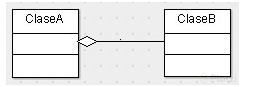

Con esto decimos que la ClaseA contiene varios elementos de la ClaseB. Estos últimos son comúnmente representados con listas o colecciones de datos.

Composición

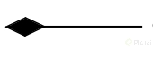

Este es similar al anterior solo que su relación es totalmente compenetrada de tal modo que conceptualmente una de estas clases no podría vivir si no existiera la otra.

“Objetos”

Objetos: Cuando tengamos un problema lo primero que debemos hacer es identificar objetos.

-Objetos: SIEMPRE son aquellos que tienen propiedades y comportamientos, deben tener un nombre que sean sustantivos, nombre para nombrar ALGO.
-Pueden ser físicos o conceptuales (que físicamente no existen, viven en nuestra mente
o son simbologías de procesos que están ocurriendo).
-Propiedades: También pueden llamarse atributos, serán sustantivos:
nombre, tamaño, forma, estado, etc.
-Comportamientos: Serán todas las operaciones del objeto, suelen ser verbos o sustantivo
y verbo. Ejemplos: login(), logout(),makeReport()

sesion de usuario_ puede tener comportamientos (Objecto conseptual)

Por cada objecto analizar sus propiedades, sus comportamientos

Clase: Lugar donde especificamos las caracteristicas de nuestro objeto, cuales atributos y comportamientos tendra

Objeto: Se crea a partir de una clase y solo puede hacer lo que esta definido en ella
Abstracción: generar caracteristicas generales de cierta cosa particular, que nos permita crear varios objetos distintos con ciertas caracteristicas en común

ABSTRACCION es cuando sacamos lo mas importante de un objeto osea enfocarnos en lo mas relevante “separar la informacion central de los detalles secundarios”

Modular: Dividir un sistema y así crear módulos independientes, lo que permite evitar un colapso masivo en nuestro código y mejorar la legibilidad.
La modularidad nos permite:
Reutilizar código
Evitar Colapsos
Mantenible
Legibilidad
Resolución Rápida de Problemas

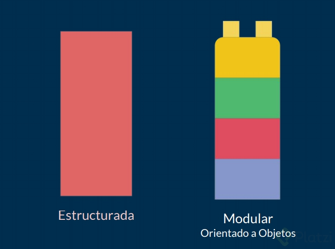

-Analisis del problema
1- Necesidad
2- Solicitar
3- Tipos
4- Tomar
-Detectar los objetos

Herencia -> Creacion de nuevas clases apartir de otras 
SuperClase -> SubClase

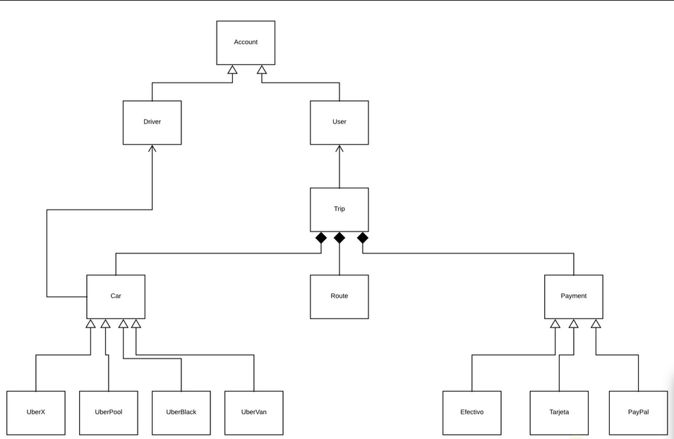

Metodo constructor

Dar un estado inicial al objecto
TIene el mismo nombre de la clase
Son los parametros minimos que necesita el objecto para que pueda vivir

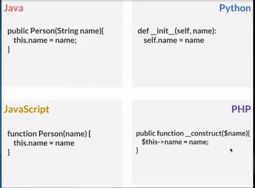

