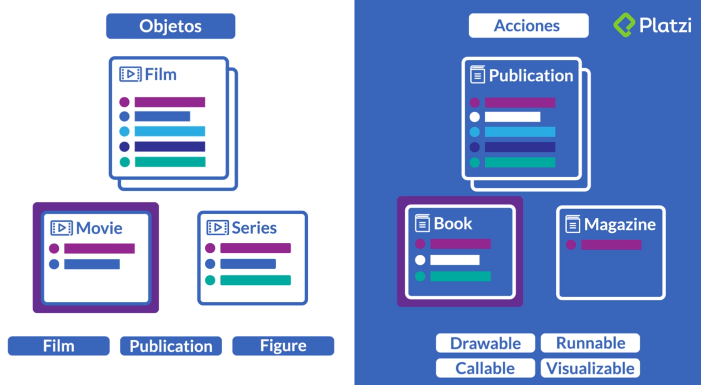

### Clases Abstractas

Clases abstractas e interfacesClases abstractas e interfacesClases abstractas e interfacesClases abstractas e interfaces    
 
Una clase abstracta...  
* es una clase que no se puede instanciar  
* se usa únicamente para definir subclases
* Clase abstracta no se implementan todos los metodos 
* No se pueden creear instancias

¿Cuándo es una clase abstracta? 
En cuanto uno de sus métodos no tiene implementación (en Java, el método abstracto se etiqueta con la palabra reservada abstract)

¿Cuándo se utilizan clases abstractas? 
Cuando deseamos definir una abstracción que englobe objetos de distintos tipos y queremos hacer uso del polimorfismo.

Ejemplo: 

Figura es una clase abstracta (nombre en cursiva en UML) porque no tiene sentido calcular su área, pero sí la de un cuadrado o un  círculo. Si una subclase de Figura no redefine area(), deberá  declararse también como clase abstracta.


```java
public abstract class Figura 
{ 
  protected double x; 
  protected double y;  
  public Figura (double x, double y) 
  { 
    this.x = x; 
    this.y = y; 
  }  
  public abstract double area (); 
} 
  
public class Circulo extends Figura 
{ 
  private double radio;  
  public Circulo (double x, double y, double radio) 
  { 
    super(x,y); 
    this.radio = radio; 
  }  
  public double area () 
  { 
    return Math.PI*radio*radio; 
  } 
} 
  
public class Cuadrado extends Figura 
{ 
  private double lado;  
  public Cuadrado (double x, double y, double lado) 
  { 
    super(x,y); 
    this.lado = lado; 
  }  
  public double area () 
  { 
    return lado*lado; 
  } 
}
```

### Interfaces 


Una interfaz es una clase completamente abstracta 
(una clase sin implementación) 
 
En el ejemplo anterior, si no estuviésemos interesados en conocer la  posición de una Figura, podríamos eliminar por completo su  implementación y convertir Figura en una interfaz:

```java
public interface Figura 
   { 
     public double area (); 
   }
```

* En Java, las interfaces se declaran con la palabra reservada  interface de manera similar a como se declaran las clases abstractas. 

* En la declaración de una interfaz, lo único que puede aparecer son declaraciones de métodos (su nombre y signatura, sin su implementación) y definiciones de constantes simbólicas. 

* Una interfaz no encapsula datos, sólo define cuáles son los métodos que han de implementar los objetos de aquellas clases que implementen la interfaz. 


```java
public class Circulo implements Figura 
{ 
  private double radio; 
 
  public Circulo (double radio) 
  { 
    this.radio = radio; 
  } 
 
  public double area () 
  { 
    return Math.PI*radio*radio; 
  } 
} 
 
 
public class Cuadrado implements Figura 
{ 
  private double lado; 
 
  public Cuadrado (double lado) 
  { 
    this.lado = lado; 
  } 
 
  public double area () 
  { 
    return lado*lado; 
  } 
} 

```

En Java, para indicar que una clase implementa una interfaz se utiliza la palabra reservada implements. 

La clase debe entonces implementar todos los métodos definidos por la interfaz o declararse, a su vez, como una clase abstracta (lo que no suele ser especialmente útil): 


```java
abstract class SinArea implements Figura 
 { 
 }
```


### Herencia múltiple de interfaces 

Una clase puede implementar varios interfaces simultáneamente, pese a que, en Java, una clase sólo puede heredar de otra clase (herencia simple de implementación, múltiple de interfaces).


```java
public abstract class Figura 
{ 
  public abstract double area (); 
} 
 
public interface Dibujable 
{ 
  public void dibujar (); 
} 
 
public interface Rotable 
{ 
  public void rotar (double grados); 
}  
 
public class Circulo extends Figura  
                     implements Dibujable 
...  
 
public class Cuadrado extends Figura  
                      implements Dibujable, Rotable 
```


El principio de segregación de interfaces Robert C. Martin: C++Report, 1996 

Los clientes de una clase no deberían depender de interfaces que no utilizan. 

PROBLEMA: Estamos implementando un sistema de seguridad en el cual controlamos varias puertas. Algunas de esas puertas van conectadas a un programa temporizador que las bloquea 
automáticamente pasado cierto tiempo:


Ahora bien, deseamos que el temporizador controle también otros 
dispositivos (como una alarma que se dispara automáticamente), por 
lo que aplicamos el principio de inversión de dependencias:


Como Java sólo permite herencia simple (de implementación),hemos hecho que Puerta herede de la clase abstracta ClienteTemporizador para que PuertaTemporizada pueda funcionar con un temporizador. 
 
Como consecuencia, todas las puertas, necesiten o no temporizador,dependen del interfaz que utilizan los clientes de Temporizador.

Contaminación de la interfaz: 

Cuando se añade un método a una clase base simplemente porque una de sus clases derivadas lo necesita. 

* La interfaz de la clase base es más compleja de lo que tiene que 
ser, al incluir métodos que no están directamente relacionados 
con ella [complejidad innecesaria] 

* Lo que se añade a la clase base tiene que estar disponible en 
todas sus clases derivadas (y funcionar correctamente, si 
queremos respetar el principio de sustitución de Liskov). 

*  Si tuviésemos que actualizar la interfaz que han de usar los 
clientes de Temporizador, tendríamos que modificar también la 
implementación de Puerta [fragilidad].

La clave: 
* Los clientes de un objeto de tipo T no necesitan una referencia al objeto de tipo T para acceder a él:  
* basta con una referencia a uno de sus tipos base, o bien  
* una referencia a un objeto auxiliar que delegue las llamadas 
necesarias en el objeto original de tipo T. 

#### Separación por herencia múltiple 
(cuando todas las clases base menos una son interfaces) 


```
class PuertaTemporizada extends Puerta 
                        implements ClienteTemporizador
```                        

#### Separación por delegación 
(cuando habría que heredar simultáneamente de varias clases) 


```
class PuertaTemporizada extends Puerta 
 ... 
 adaptador = new AdaptadorPT (this); 
 temporizador.registrar(adaptador);
```

Ejemplo: Banca electrónica 

Un sistema de banca electrónica debe tener varias interfaces de usuario para que los clientes del banco puedan efectuar operaciones 
(en un cajero automático, por teléfono y por Internet)


Sea cual sea el medio escogido,  
el cliente ha de poder ejecutar varias transacciones:  
* Realizar depósitos (ingresar dinero en su cuenta).  
* Retirar efectivo (sacar dinero de su cuenta).  
* Realizar transferencias de dinero.  
* Consultar el saldo y los últimos movimientos.  
* Recargar el móvil 


#### Solución A 
Interfaz “contaminado” 

Cada tipo de transacción utiliza algunos métodos  que las demás transacciones no siempre utilizan... 

Un nuevo tipo de transacción introducirá cambios en InterfazUsuario que afectarán al funcionamiento de los demás tipos de transacciones. 


#### Solución B 
Adaptadores 


### Solución C 
Segregación de interfaces 


### Ejercicio. Clases Abstractas

Tengo un programa que dibuja figuras automáticamente.

He creado una clase abstracta llamada Figura, esta tiene un método llamado dibujate()

¿Qué tendría que hacer para que la clase Triangulo pueda sobreescribir este método y poner el código que haga que dibuje la forma indicada?

Analiza el problema, realiza tu diagrama y comparte tu respuesta en la sección de discuciones.


```java
public abstract class Figura {
	public abstract void dibujate();
}

public class Triangulo extends Figura {

	@Override
	public void dibujate() {
		System.out.println("Voy a dibujar un Triangulo");
	}	

}
```

### Qué es JavaDocs

En java habría dos tipos de comentario y una forma de crear la documentación.

Para insertar comentarios seria

// Primera forma de Comentario
/*Segunda forma de Comentario en bloques de varias lineas */

para generar la documentación seria:

/**
* Documentación de métodos, clases, 
*
*/


Algunas etiquetas Javadoc y su significado:

* @author: Nombre del desarrollador.
* @version: Versión del método o clase.
* @param: Definición de un parámetro de un método, es requerido para todos los parámetros del método.
* @return: Informa de lo que devuelve el método, no se puede usar en constructores o métodos “void”.
* @exception: Excepción lanzada por el método, posse un sinonimo de nombre @throws
* @see: Enlaza con otro método o clase.
* @deprecated: Indica que el método o clase es antigua y que no se recomienda su uso porque posiblemente desaparecerá en versiones posteriores.


### Clases anidadas y tipos

Clase estatica: son básicamente lo mismo que una clase no estática, pero hay una diferencia: una clase estática no puede ser instanciada.

Clase anidada: Las clases anidadas te permiten agrupar lógicamente clases que solo se utilizan en un lugar, por lo tanto, esto aumenta el uso de la encapsulación y crea un código más fácil de leer y de mantener.

Las clases anidadas te permiten agrupar lógicamente clases que solo se utilizan en un lugar, por lo tanto, esto aumenta el uso de la encapsulación y crea un código más fácil de leer y de mantener.

* Una clase anidada no existe independientemente de su clase adjunta. Por lo tanto, el alcance de una clase anidada está limitado por su clase externa.

* Una clase anidada también es miembro de su clase adjunta. También es posible declarar una clase anidada que es local a un bloque.

* Como miembro de su clase adjunta, una clase anidada se puede declarar private, public, protected, o default (Leer sobre Modificadores de acceso).

* Una clase anidada tiene acceso a los miembros, incluidos los miembros privados, de la clase en la que está anidado. Sin embargo, lo inverso no es verdadero, es decir, la clase adjunta no tiene acceso a los miembros de la clase anidada.

* Hay dos tipos generales de clases anidadas: las que están precedidas por el modificador static (static nested class) y las que no lo están (inner class).


Clases Anidades - Inner
```java
class OuterClass {
  int x = 10;

  class InnerClass {
    int y = 5;
  }

}

public class MyMainClass {
  public static void main(String[] args) {
    OuterClass myOuter = new OuterClass();
    OuterClass.InnerClass myInner = myOuter.new InnerClass();
    System.out.println(myInner.y + myOuter.x);
  }
}
```

Clases Locales a Metodo

```java
class NewEnclosing {

  void run(){
    class Local {
      void run(){
        //Method implementation
      }
    }

    Local local = new Local();
    local.run();
  }

  @Test
  public void test(){
    NewEnclosing newEnclosing = new NewEnclosing();
    newEnclosing.run();
  }
}


```

Clases anonimas (Son clases Abstractas ** )
Un metodo sin implementacion

```java
abstract class SimpleAbstractClass {
  abstract void run();
}


public class AnonymousInnerTest{

  @Test
  public void whenRunAnonymousClass_thenCorrect(){
    SimpleAbstractClass simpleAbstractClass = new SimpleAbstractClass(){
      void run(){
        //method implementation
      }
    };
    simpleAbstractClass.run();
  }
}
```


### Ejercicio. Clases Anidadas

Album.java
```java

public class Album {

    private String name;
    private String author;
    private int year;
    private Song[] songs;

    public Album(String name, String author, int year) {
        this.name = name;
        this.author = author;
        this.year = year;
    }

    public void setAlbum(String[] names, int[] durations) {
        Song[] songs = new Song[names.length];
        for (int i = 0; i < names.length; i++) {
            songs[i] = new Song(names[i], durations[i]);
        }
        this.songs = songs;
    }

    private String getAlbum() {
        StringBuilder sb = new StringBuilder();
        for (Song song : songs) {
            sb.append(song);
        }
        return sb.toString();
    }

    public String toString() {
        return "\nALBUM: " + name +
                "\nAUTHOR: " + author +
                "\nYEAR: " + year +
                "\n\n::SONGS::\n" + getAlbum();
    }


    private static class Song {

        private String name;
        private int duration;

        private Song(String name, int duration) {
            this.name = name;
            this.duration = duration;
        }

        public String toString() {
            return "\nName: " + name +
                    "\nDuration: " + duration + " seconds\n";
        }
    }
}
```

Main.java

```java
public static void main(String[] args) {
        String[] names = {"Uno", "Divenire", "Monday", "Andare", "Rose", "Primavera", "Oltremare", "L'origine Nascosta", "Fly", "Ascolta", "Ritornare", "Svanire"};
        int[] durations = {228, 402, 355, 422, 256, 444, 660, 192, 279, 289, 532, 449};
        Album album = new Album("Divenire","Ludovico Einaudi",2006);
        album.setAlbum(names, durations);
        System.out.println(album);
}
```

### Enumerations

Los enumerations son tipos de datos muy especiales pues es el único tipo de dato que posee una colección de constantes, al ser constantes estaremos obligados a escribirlos con mayúsculas.

Usaremos enum cada vez que necesitemos representar un conjunto fijo de constantes. Por ejemplo los días de la semana.

Así podemos declarar un enumeration usando la palabra reservada enum.


```java
public enum Day {
    SUNDAY, MONDAY, TUESDAY, WEDNESDAY, THURSDAY, FRIDAY, SATURDAY
}
```

Puedo crear referencias de enumerations de la siguiente forma:

```java
    Day day;
    switch(day){
        case MONDAY:
            System.out.println("MONDAY ARE BAD."); 
        case FRIDAY:
            System.out.println("MONDAY ARE BETTER.");
        default:
            System.out.println("lorem ");
            break;
    }
```

Y puedo llamar un valor del enumeration así:

```java

Day.MONDAY
Day.FRIDAY

```

Los enumerations pueden tener atributos, métodos y constructores, como se muestra:

```java

public enum Day {
    SUNDAY("Domingo"), 
    MONDAY("Lunes"), 
    TUESDAY("Martes"), 
    WEDNESDAY("Miercoles"), 
    THURSDAY("Jueves"), 
    FRIDAY("Viernes"), 
    SATURDAY("Sabado")

    private String spanish;
    private Day(String s ){
      spanish = s;
    }

    public String getSpanish(){
      return spanish;
    }
}

//Y para utilizarlo lo podemos hacer así:

System.out.println(Day.MONDAY); //Imprimira MONDAY
System.out.println(Day.MONDAY.getSpanish()); //Imprimira Lunes
```

### Métodos con implementación métodos default y private


```java

//Se puede conectar a circuitos
public interface MyInterface {

  default void defaultMethod(){
    privateMethod("Hello");
  
  }

  private void privateMethod(final String string){
    System.out.println(string);
  }


  void normalMethod()
}
```

El ejemplo que das para usar privateMethod va de la mano con el patrón de estructura Facade porque integra un conjunto de interfaces de un subsistema, cierto? Es fascinante este nuevo feature 

DAO 

### Diferencias entre una clase Abstracta vs Interfaces

Clase Abstracta:

* Se podrán definir métodos con implementación y sin implementación (abstract).
* No se pueden usar instancias (crear objetos).
* Se utilizará para definir subclases. Siempre será heredada para poder utilizar y sobrescribir los métodos de su clase padre.
* La herencia de los atributos y métodos se hará de forma líneal. De una clase padre a una clase hija.
* Se pueden ir heredando métodos abstractos y no abstractos.
* Redefinir nuevas clases sin crear nuevos objetos.
* Se piensa en una clase abstracta cuando el enfoque es más en objetos (de las subclases).
* Se pueden encontrar clases como Figure que se pueden crear clases como Circle, Square, Triangle.
    
Interfaces:
* Nuevos modificadores de acceso (default y private). Esto permite añadir comportamiento a los métodos.
* Se podrán definir métodos con implementación y sin implementación.
* Los métodos se pueden implementar en muchas familias de clases. Por lo cual no es líneal.
* Se utiliza una interface cuando existen métodos que se pueden implementar en muchas familias (La relación va más allá entre dos clases).
* Se piensa en una interface cuando el enfoque es más en las acciones que pueden tener en común muchos objetos.
* Se encuentra acciones como Drawable Dibujable, Runna* Ejecutable, Callable Llamable, Visualizable Visualizable.


Una buena práctica es que el diseño de las aplicaciones siempre esté orientado a interfaces y no a la implementación. Crear buenas abstracciones. Encontrar el comportamiento común. Enfocarse en la declaración de los métodos.





### Herencia en Interfaces


Las interfaces pueden heredar de otras interfaces utilizando la palabra clave extends, el concepto de herencia se aplicará como naturalmente se practica en clases, es decir, la interfaz heredará y adquirirá los métodos de la interfaz padre.

Una cosa interesante que sucede en caso de herencia con interfaces es que, aquí sí es permitido la herencia múltiple como ves a continuación:


Además siguiendo las nuevas implementaciones de métodos default y private de las versiones Java 8 y 9 respectivamente podemos sobreescribir métodos y añadirles comportamiento, si es el caso.


### Map, HashMap, TreeMap y LinkedHashMap

En el Curso Básico de Java vimos esta estructura de Colecciones interfaces


#### Map
Lo primero que debes saber es que tiene tres implementaciones:

* HashTable
* LinkedHashMap
* HashMap
* SortedMap ➡️ TreeMap


La interfaz Map no hereda de la interfaz Collection porque representa una estructura de datos de Mapeo y no de colección simple de objetos. Esta estructura es más compleja, pues cada elemento deberá venir en pareja con otro dato que funcionará como la llave del elemento.

Map<K,V>

* Donde K es el key o clave
* Donde V es el value o valor

Podemos declarar un map de la siguiente forma:

```java
Map<Integer, String> map = new HashMap<Integer, String>();
Map<Integer, String> treeMap = new TreeMap<Integer, String>();
Map<Integer, String> linkedHashMap = new LinkedHashMap<Integer, String>();
```

Como observas solo se puede construir el objeto con tres elementos que implementan de ella: HashMap, TreeMap y LinkedHashMap dejando fuera HashTable y SortedMap. SortedMap estará fuera pues es una interfaz y HashTable ha quedado deprecada pues tiene métodos redundantes en otras clases. Mira la funcionalidad de cada uno.

Como te conté hace un momento Map tiene implementaciones:

* HashMap: Los elementos no se ordenan. No aceptan claves duplicadas ni valores nulos.
* LinkedHashMap Ordena los elementos conforme se van insertando; provocando que las búsquedas sean más lentas que las demás clases.
* TreeMap El Mapa lo ordena de forma “natural”. Por ejemplo, si la clave son valores enteros (como luego veremos), los ordena de menos a mayor.

Para iterar alguno de estos será necesario utilizar la interface Iterator y para recorrerlo lo haremos un bucle while así como se muestra:

```java
// Para HashMap
// Imprimimos el Map con un Iterador
Iterator it = map.keySet().iterator();
while(it.hasNext()){
  Integer key = it.next();
  System.out.println("Clave: " + key + " -> Valor: " + map.get(key));
}

// Para LinkedHashMap
// Imprimimos el Map con un Iterador
Iterator it = linkedHashMap.keySet().iterator();
while(it.hasNext()){
  Integer key = it.next();
  System.out.println("Clave: " + key + " -> Valor: " + linkedHashMap.get(key));
}

//Para TreeMap
// Imprimimos el Map con un Iterador
Iterator it = treeMap.keySet().iterator();
while(it.hasNext()){
  Integer key = it.next();
  System.out.println("Clave: " + key + " -> Valor: " + treeMap.get(key));
}


```

https://docs.oracle.com/javase/tutorial/collections/interfaces/deque.html


Deque es la interfaz que nos proporciona java para manejar una lista doblemente enlazada. La interfaz Deque nos proporciona una abstracción de los métodos que necesitaremos para manejar tanto una Cola como una Pila.
Ademas de esta interfaz java los proporciona las siguientes implementasiones de la misma:

* ArrayDeque
* ConcurrentLinkedDeque
* LinkedBlockingDeque
* LinkedList


### Manejo de errores


```java
public class Hola {
	
	public static int numerador = 10;
	public static Integer denominador = 0;
	public static float division;
	
	public static void main(String []args) {

		try {
			division = nuemrador / denominador;
		} catch (AritmeticException e) {
			division = 0;
			System.out.println("Error "+e.getMessage());
		} 
	}
}
```

finally -> Siempre se ejecuta

### Definición y composición del API

Clases:

* DriverManager: Nos permite crear una instancia de la conexión
* Connection: Genera la sesión, maneja todo el ciclo de vida de una sesión cuando nos conectamos a una base de datos.
* Statement: Nos ayuda a traer datos de una tabla.
* PreparedStatement: Hace lo mismo que Statement con la diferencia de que éste nos permite recibir parámetros para la clausula where.
* ResultSet: Es una interfaz que nos ayudará a manejar los datos obtenidos convirtiendo los datos en objetos.

Para generar un CRUD también tenemos métodos a partir de Statement/PreparedStatement:

* Para ejecutar un SELECT el método a usar será el: executeQuery(sqlString)
* Para ejecutar INSERT,UPDATE,DELETE or a DDL usaremos el método: executeUpdate(sqlString)
* Para ejecutar otros comandos de SQL usaremos: execute(sqlString)

### Conectarse a una base de datos

Descargar el conector

https://dev.mysql.com/downloads/connector/j/

dpkg -x mysql-connector-java_8.0.26-1ubuntu21.04_all.deb extrated

buscamos el archivo mysql-connector-java-8.0.26.jar

Lo configuramos en nuestro Intellij, se agrega el connector en File->Project Structure->Libraries … Add -> From JAVA

```sql
ALTER TABLE `amazonviewer`.`viewed` ADD COLUMN `datetime` DATETIME NOT NULL AFTER `id_user`;

  SELECT * FROM amazonviewer.movie AS m INNER JOIN amazonviewer.viewed AS v
  ON m.id = v.id_element
  WHERE v.id_material = 1 AND v.id_user = 2
  AND DATE(v.`datetime`) = '2021-09-22';

```


### **Interfaces funcionales **

SAM
@FunctionalInterface -> Interfaz de un solo metodo


Concepto nuevo en Java SE 8 y que es la base para que podamos escribir expresiones lambda. Una interface funcional se define como una interface que tiene uno y solo un método abstracto y que éste sea diferente a los métodos definidos en java.lang.Object (a saber: equals, hashcode, clone, etc.). La interface puede tener métodos por defecto y estáticos sin que esto afecte su condición de ser interface funcional.

Existe una nueva anotación denominada @FunctionalInterface que permite al compilador realizar la validación de que la interface tenga solamente un método abstracto

### Programación Funcional Que?

Acciones a realizar ** 


Partes clave:
Programación funcional, paradigma de programación.

Paradigma declarativa vs imperativa
Imperativa: Estructurados, Procedimental, OOP, Otros
Declarativa: Funcional, Lógica, Otros

Programación Imperativa: Cómo?
Enfoque: delimitar todos los pasos para resolver el problema.
Programación funcional: Qué?
Enfoque: declarar qué está haciendo el programa

Núcleo de la Programación funcional: funciones**
entrada dato -> función -> salida dato

Funciones de orden superior, característica de programación funcional
entrada como función -> función como operación -> salida como función

HOF

### Lambdas: > Java 8

Estructura básica: (parámetros) -> {cuerpo-lambda}

Se utilizan únicamente en caso de:

* Código con un tiempo de vida corto.
* Encapsular código específico.

Para definir una lambda podemos hacerlo al implementar:

* Interfaces funcionales
* Clases abstractas

### Stream y Filter

La clase StringBuilder crea cadenas que permiten mutación
El encadenado es distinto a String. Con String, el resultado es una nueva cadena. StringBuilder realiza los cambios en la misma cadena, y devuelve una referencia a la misma

StringBuilder sb=new StringBuilder(“uno”);
sb.append("+dos");
StringBuilder otro=sb.append("+tres");


### Predicate y Consumer

Existen 4 tipos de expresiones Lambda:

Funciones (Function): Recibe como argumento dos parámetros de los cuales el primero <T> corresponde al tipo (objeto) de entrada y el segundo <R> como el tipo de salida de aquella operación.
Ejemplo:

```java
Function<String, Integer> function = s -> s.length() + s.indexOf(" "); 

// 10 + 4?Integer result = function.apply("Hola mundo"); // Tiene 10 caracteres y el " " se ubica 										      // en la posición 4.
```
Consumidores (Consumer): Un consumidor es aquella expresión que recibe un parámetro de entrada <T> pero que no retorna o genera ningún valor de salida. Son funciones terminales.
Ejemplo:

```java
Consumer<String> consumer = s -> System.out.println(s.toLowerCase()); 
consumer.accept("Hola Mundo");
```

Proveedores (Supplier): Un proveedor es una expresión que no recibe parámetros de entrada pero que retornan o generan un tipo de salida <T>

```java
Supplier<String> supplier = () -> "Hola mundo"; 
supplier.get();
Salida: "Hola mundo"
```
Predicados (Predicate): Los predicados son expresiones que aceptan expresiones booleanas, es decir, condiciones lógicas.

```java
Predicate<String> predicate = (str) -> str.length() > 6; 
predicate.test("Hola mundo");
Salida: true
```
