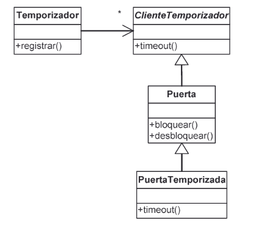
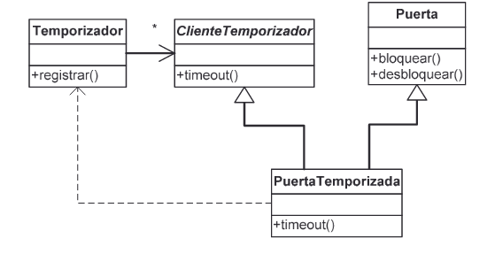
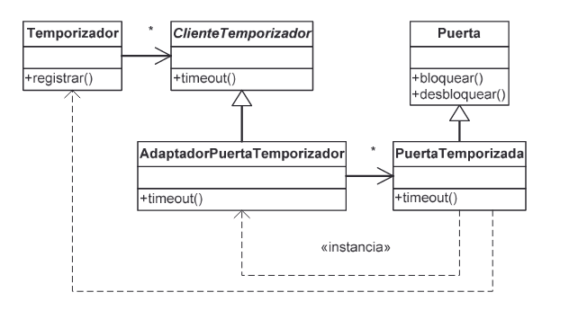
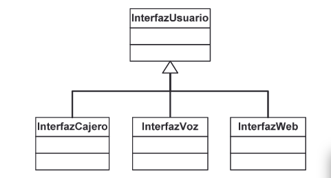
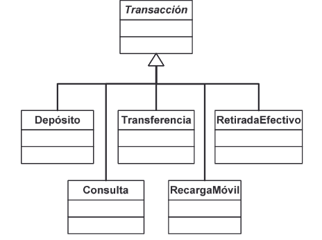
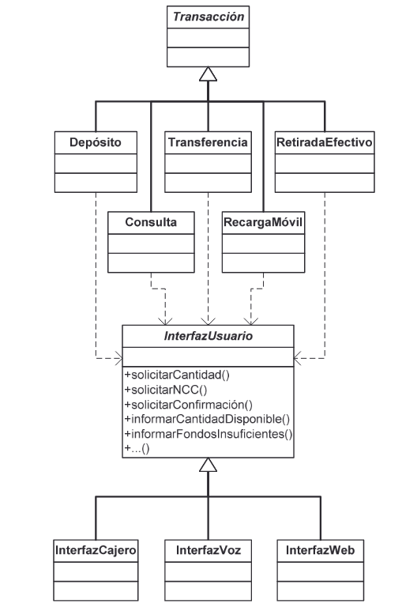
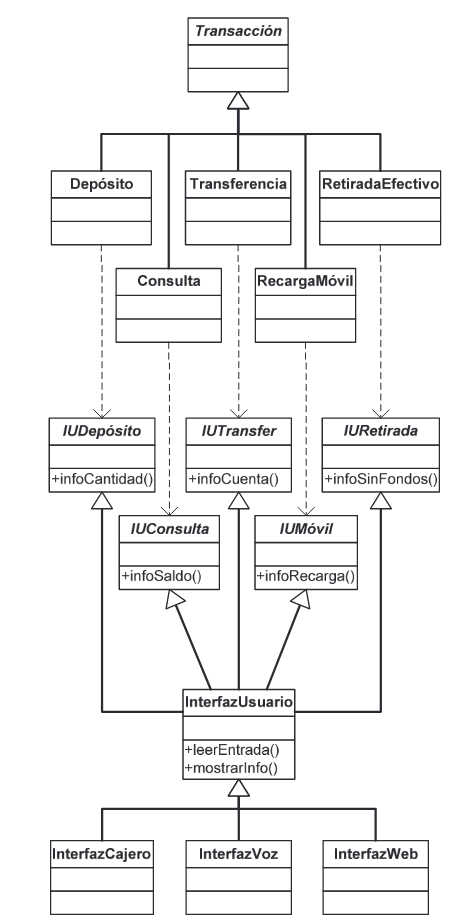

### Clases Abstractas

Clases abstractas e interfacesClases abstractas e interfacesClases abstractas e interfacesClases abstractas e interfaces    
 
Una clase abstracta...  
* es una clase que no se puede instanciar  
* se usa únicamente para definir subclases
* Clase abstracta no se implementan todos los metodos 
* No se pueden creear instancias

¿Cuándo es una clase abstracta? 
En cuanto uno de sus métodos no tiene implementación (en Java, el método abstracto se etiqueta con la palabra reservada abstract)

¿Cuándo se utilizan clases abstractas? 
Cuando deseamos definir una abstracción que englobe objetos de distintos tipos y queremos hacer uso del polimorfismo.

Ejemplo: 

Figura es una clase abstracta (nombre en cursiva en UML) porque no tiene sentido calcular su área, pero sí la de un cuadrado o un  círculo. Si una subclase de Figura no redefine area(), deberá  declararse también como clase abstracta.


```java
public abstract class Figura 
{ 
  protected double x; 
  protected double y;  
  public Figura (double x, double y) 
  { 
    this.x = x; 
    this.y = y; 
  }  
  public abstract double area (); 
} 
  
public class Circulo extends Figura 
{ 
  private double radio;  
  public Circulo (double x, double y, double radio) 
  { 
    super(x,y); 
    this.radio = radio; 
  }  
  public double area () 
  { 
    return Math.PI*radio*radio; 
  } 
} 
  
public class Cuadrado extends Figura 
{ 
  private double lado;  
  public Cuadrado (double x, double y, double lado) 
  { 
    super(x,y); 
    this.lado = lado; 
  }  
  public double area () 
  { 
    return lado*lado; 
  } 
}
```

### Interfaces 


Una interfaz es una clase completamente abstracta 
(una clase sin implementación) 
 
En el ejemplo anterior, si no estuviésemos interesados en conocer la  posición de una Figura, podríamos eliminar por completo su  implementación y convertir Figura en una interfaz:

```java
public interface Figura 
   { 
     public double area (); 
   }
```

* En Java, las interfaces se declaran con la palabra reservada  interface de manera similar a como se declaran las clases abstractas. 

* En la declaración de una interfaz, lo único que puede aparecer son declaraciones de métodos (su nombre y signatura, sin su implementación) y definiciones de constantes simbólicas. 

* Una interfaz no encapsula datos, sólo define cuáles son los métodos que han de implementar los objetos de aquellas clases que implementen la interfaz. 


```java
public class Circulo implements Figura 
{ 
  private double radio; 
 
  public Circulo (double radio) 
  { 
    this.radio = radio; 
  } 
 
  public double area () 
  { 
    return Math.PI*radio*radio; 
  } 
} 
 
 
public class Cuadrado implements Figura 
{ 
  private double lado; 
 
  public Cuadrado (double lado) 
  { 
    this.lado = lado; 
  } 
 
  public double area () 
  { 
    return lado*lado; 
  } 
} 

```

En Java, para indicar que una clase implementa una interfaz se utiliza la palabra reservada implements. 

La clase debe entonces implementar todos los métodos definidos por la interfaz o declararse, a su vez, como una clase abstracta (lo que no suele ser especialmente útil): 


```java
abstract class SinArea implements Figura 
 { 
 }
```


### Herencia múltiple de interfaces 

Una clase puede implementar varios interfaces simultáneamente, pese a que, en Java, una clase sólo puede heredar de otra clase (herencia simple de implementación, múltiple de interfaces).


```java
public abstract class Figura 
{ 
  public abstract double area (); 
} 
 
public interface Dibujable 
{ 
  public void dibujar (); 
} 
 
public interface Rotable 
{ 
  public void rotar (double grados); 
}  
 
public class Circulo extends Figura  
                     implements Dibujable 
...  
 
public class Cuadrado extends Figura  
                      implements Dibujable, Rotable 
```


El principio de segregación de interfaces Robert C. Martin: C++Report, 1996 

Los clientes de una clase no deberían depender de interfaces que no utilizan. 

PROBLEMA: Estamos implementando un sistema de seguridad en el cual controlamos varias puertas. Algunas de esas puertas van conectadas a un programa temporizador que las bloquea 
automáticamente pasado cierto tiempo:


Ahora bien, deseamos que el temporizador controle también otros 
dispositivos (como una alarma que se dispara automáticamente), por 
lo que aplicamos el principio de inversión de dependencias:



Como Java sólo permite herencia simple (de implementación),hemos hecho que Puerta herede de la clase abstracta ClienteTemporizador para que PuertaTemporizada pueda funcionar con un temporizador. 
 
Como consecuencia, todas las puertas, necesiten o no temporizador,dependen del interfaz que utilizan los clientes de Temporizador.

Contaminación de la interfaz: 

Cuando se añade un método a una clase base simplemente porque una de sus clases derivadas lo necesita. 

* La interfaz de la clase base es más compleja de lo que tiene que 
ser, al incluir métodos que no están directamente relacionados 
con ella [complejidad innecesaria] 

* Lo que se añade a la clase base tiene que estar disponible en 
todas sus clases derivadas (y funcionar correctamente, si 
queremos respetar el principio de sustitución de Liskov). 

*  Si tuviésemos que actualizar la interfaz que han de usar los 
clientes de Temporizador, tendríamos que modificar también la 
implementación de Puerta [fragilidad].

La clave: 
* Los clientes de un objeto de tipo T no necesitan una referencia al objeto de tipo T para acceder a él:  
* basta con una referencia a uno de sus tipos base, o bien  
* una referencia a un objeto auxiliar que delegue las llamadas 
necesarias en el objeto original de tipo T. 

#### Separación por herencia múltiple 
(cuando todas las clases base menos una son interfaces) 



```
class PuertaTemporizada extends Puerta 
                        implements ClienteTemporizador
```                        

#### Separación por delegación 
(cuando habría que heredar simultáneamente de varias clases) 



```
class PuertaTemporizada extends Puerta 
 ... 
 adaptador = new AdaptadorPT (this); 
 temporizador.registrar(adaptador);
```

Ejemplo: Banca electrónica 

Un sistema de banca electrónica debe tener varias interfaces de usuario para que los clientes del banco puedan efectuar operaciones 
(en un cajero automático, por teléfono y por Internet)




Sea cual sea el medio escogido,  
el cliente ha de poder ejecutar varias transacciones:  
* Realizar depósitos (ingresar dinero en su cuenta).  
* Retirar efectivo (sacar dinero de su cuenta).  
* Realizar transferencias de dinero.  
* Consultar el saldo y los últimos movimientos.  
* Recargar el móvil 




#### Solución A 
Interfaz “contaminado” 

Cada tipo de transacción utiliza algunos métodos  que las demás transacciones no siempre utilizan... 

Un nuevo tipo de transacción introducirá cambios en InterfazUsuario que afectarán al funcionamiento de los demás tipos de transacciones. 



#### Solución B 
Adaptadores 


### Solución C 
Segregación de interfaces 


