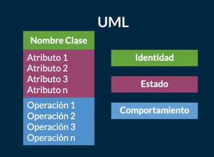
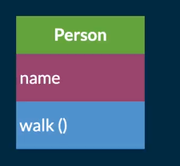

## Clases del Curso de Java SE Orientado a Objetos

Los paradigmas de programación son una teoría que nos suministra una base y modelo estandarizado para resolver problemas con nuestro código.

La Programación Orientada a Objetos (POO) nos ayuda a analizar y entender todos estos problemas para resolverlos de la forma más sostenible en el futuro. Java surgió con este paradigma y es uno de los lenguajes que define en gran manera el rumbo que sigue la POO.

Este paradigma se compone de 4 elementos (que analizaremos a fondo más adelante):

* Clases
* Propiedades
* Métodos
* Objetos

Además, se basa en los siguientes 4 pilares:

* Encapsulamiento
* Abstracción
* Herencia
* Polimorfismo


### ¿Qué es un Objeto?

Los Objetos son todas las cosas físicas o conceptuales que tienen propiedades y comportamientos. Por ejemplo: usuario, sesión, auto, etc.

Las Propiedades o atributos son las características de nuestros objetos. Estos atributos siempre serán sustantivos y pueden tener diferentes valores que harán referencia a nombres, tamaños, formas y estados. 

Por ejemplo: el color del auto es verde o rojo (color es el atributo, verde y rojo son posibles valores para este atributo).

Los Comportamientos o métodos serán todas las operaciones de nuestros objetos que solemos llamar usando verbos o sustantivos y verbos. Por ejemplo: los métodos del objeto sesión pueden ser login(), logout(), makeReport(), etc.


### Abstracción: ¿Qué es una Clase?

La Abstracción se trata de analizar objetos de forma independiente, sus propiedades, características y comportamientos, para abstraer su composición y generar un modelo, lo que traducimos a código como clases.

Las Clases son los modelos sobre los cuales construimos nuestros objetos, es decir, las clases son los “moldes” que nos permiten generar objetos. Cada clase debe tener identidad (con un nombre de clase único usando Upper Camel Case), estado (con sus atributos) y comportamiento (con sus métodos y operaciones).

Por ejemplo:

```
El ejemplo de clase más típico en Internet:
Nombre de la clase: Person
Atributos: Name, Age
Operaciones: Walk()
```




* Atributos: Los atributos o características de una Clase pueden ser de tres tipos, definen la visibilidad:
* Public (+): Indica que el atributo será visible tanto dentro como fuera de la clase, es decir, es accesible desde todos lados.
* Private(-): Indica que el atributo sólo será accesible desde dentro de la clase (sólo sus métodos lo pueden acceder).
*  Protected (#): Indica que el atributo no será accesible desde fuera de la clase, pero si podrá ser accedido por métodos de la clase además de las subclases que se deriven (herencia).
*  Sin modificador de acceso ( ): Indica que el atributo será accesible desde cualquier clase que se encuentre en el mismo paquete de la clase que contiene al atributo sin modificador de acceso.
Métodos:
Los métodos u operaciones de una clase son la forma en cómo ésta interactúa con su entorno, éstos pueden tener las características:
*  Public (+): Indica que el método será visible tanto dentro como fuera de la clase, es decir, es accesible desde todos lados.
*  Private (-): Indica que el método sólo será accesible desde dentro de la clase (sólo otros métodos de la clase lo pueden acceder).
*  Protected (#): Indica que el método no será accesible desde fuera de la clase, pero si podrá ser accedido por métodos de la clase además de métodos de las subclases que se deriven (herencia).
*  Sin modificador de acceso ( ): Indica que el método será
accesible desde cualquier clase que se encuentre en el mismo
paquete de la clase que contiene al método sin modificador de
acceso.
