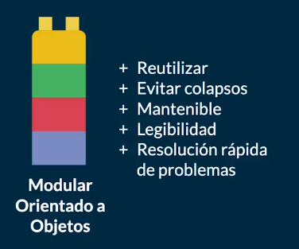
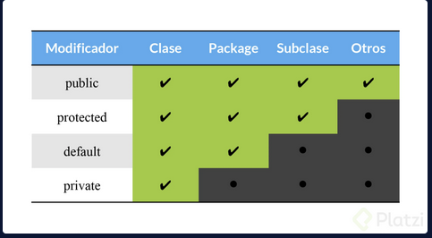
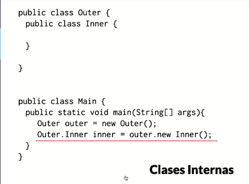
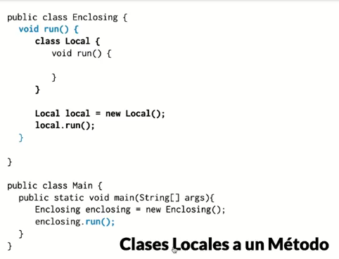
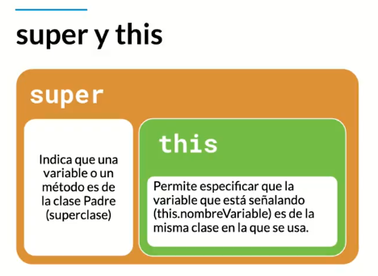
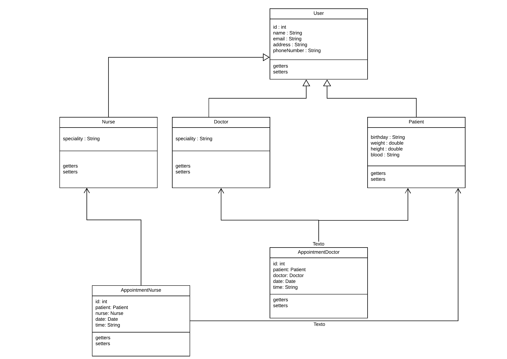
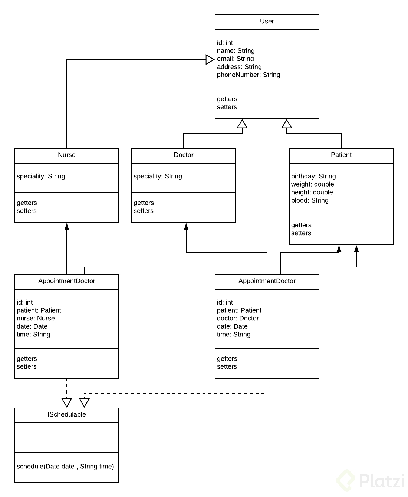
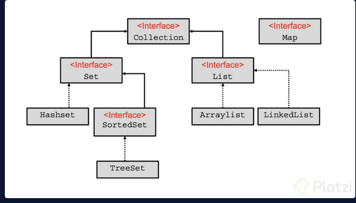
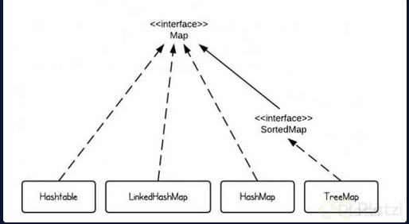

## Clases del Curso de Java SE Orientado a Objetos

Los paradigmas de programación son una teoría que nos suministra una base y modelo estandarizado para resolver problemas con nuestro código.

La Programación Orientada a Objetos (POO) nos ayuda a analizar y entender todos estos problemas para resolverlos de la forma más sostenible en el futuro. Java surgió con este paradigma y es uno de los lenguajes que define en gran manera el rumbo que sigue la POO.

Este paradigma se compone de 4 elementos (que analizaremos a fondo más adelante):

* Clases
* Propiedades
* Métodos
* Objetos

Además, se basa en los siguientes 4 pilares:

* Encapsulamiento
* Abstracción
* Herencia
* Polimorfismo


### ¿Qué es un Objeto?

Los Objetos son todas las cosas físicas o conceptuales que tienen propiedades y comportamientos. Por ejemplo: usuario, sesión, auto, etc.

Las Propiedades o atributos son las características de nuestros objetos. Estos atributos siempre serán sustantivos y pueden tener diferentes valores que harán referencia a nombres, tamaños, formas y estados. 

Por ejemplo: el color del auto es verde o rojo (color es el atributo, verde y rojo son posibles valores para este atributo).

Los Comportamientos o métodos serán todas las operaciones de nuestros objetos que solemos llamar usando verbos o sustantivos y verbos. Por ejemplo: los métodos del objeto sesión pueden ser login(), logout(), makeReport(), etc.


### Abstracción: ¿Qué es una Clase?

La Abstracción se trata de analizar objetos de forma independiente, sus propiedades, características y comportamientos, para abstraer su composición y generar un modelo, lo que traducimos a código como clases.

Las Clases son los modelos sobre los cuales construimos nuestros objetos, es decir, las clases son los “moldes” que nos permiten generar objetos. Cada clase debe tener identidad (con un nombre de clase único usando Upper Camel Case), estado (con sus atributos) y comportamiento (con sus métodos y operaciones).

Por ejemplo:

```
El ejemplo de clase más típico en Internet:
Nombre de la clase: Person
Atributos: Name, Age
Operaciones: Walk()
```


* Atributos: Los atributos o características de una Clase pueden ser de tres tipos, definen la visibilidad:
* Public (+): Indica que el atributo será visible tanto dentro como fuera de la clase, es decir, es accesible desde todos lados.
* Private(-): Indica que el atributo sólo será accesible desde dentro de la clase (sólo sus métodos lo pueden acceder).
*  Protected (#): Indica que el atributo no será accesible desde fuera de la clase, pero si podrá ser accedido por métodos de la clase además de las subclases que se deriven (herencia).
*  Sin modificador de acceso ( ): Indica que el atributo será accesible desde cualquier clase que se encuentre en el mismo paquete de la clase que contiene al atributo sin modificador de acceso.
Métodos:
Los métodos u operaciones de una clase son la forma en cómo ésta interactúa con su entorno, éstos pueden tener las características:
*  Public (+): Indica que el método será visible tanto dentro como fuera de la clase, es decir, es accesible desde todos lados.
*  Private (-): Indica que el método sólo será accesible desde dentro de la clase (sólo otros métodos de la clase lo pueden acceder).
*  Protected (#): Indica que el método no será accesible desde fuera de la clase, pero si podrá ser accedido por métodos de la clase además de métodos de las subclases que se deriven (herencia).
*  Sin modificador de acceso ( ): Indica que el método será
accesible desde cualquier clase que se encuentre en el mismo
paquete de la clase que contiene al método sin modificador de
acceso.

### Modularidad

La Modularidad consiste en dividir nuestro programa en diferentes módulos de forma que puedan unirse o separarse sin romperse entre ellos o perder alguna funcionalidad.

La Modularidad en Programación Orientada a Objetos nos ayuda a:

* Reutilizar código.
* Evitar colapsos.
* Que nuestro código sea mantenible.
* Mejorar la legibilidad.
* Resolución rápida de problemas.



### Creando nuestra primera Clase


Nuestro proyecto en este curso es construir un sistema que nos permita listar y agendar nuestras citas médicas, por lo que debemos crear algunas clases para cada integrante del sistema: doctores, pacientes, entre otras.

Así vamos a crear nuestra primer clase con sus métodos y atributos:

```java
// Clases:
public class Doctor {
  // Atributos:
  int id;
  String name;
  String speciality;

  // Comportamientos (métodos):
  public void showName() {
    // Instrucciones...
  }
}
```

Declarar un Objeto:

```java
// Tipo de Objeto ---- Nombre del Objeto
Doctor myDoctor;

// Otro objeto del mismo tipo Doctor:
Doctor anotherDoctor;
```

Instanciar un Objeto:

```java
// Nombre del Objeto ---- Clase base para crear algún tipo de objetos
myDoctor = new Doctor();

// Otro objeto
anotherDoctor = new Doctor();

Declarar e instanciar un objeto en la misma línea:

// Declarar el objeto ---- Instanciar el objeto
Doctor myDoctor = new Doctor();

Utilizar el objeto:

// Declarar el objeto ---- Instanciar el objeto
Doctor myDoctor = new Doctor();
myDoctor.name = "Anahí Salgado";
myDoctor.showName();

```

### Método constructor


El Método Constructor es el primer método que se ejecuta por defecto cuando creamos una clase, nos permite crear nuevas instancias de una clase. Lo invocamos con la palabra reservada new seguida del nombre con el que inicializamos la clase y paréntesis.

```java
// nombreDeLaInstancia = new MétodoConstructor();
myDoctor = new Doctor();
```

El compilador de Java crea un método constructor en caso de que no definamos uno, pero de todas formas es muy buena idea programarlo nosotros, ya que nos permite definir y/o configurar el comportamiento de nuestros objetos usando argumentos.

```java
public class Doctor {
  // Atributos...

  // Método Constructor:
  Doctor(/* parámetros */) {
    // Instrucciones que se ejecutan al crear/instanciar
    // un nuevo objeto con la clase Doctor...
  }
}

```
El método constructor no debe regresar ningún valor (no necesitamos un return). Más adelante estudiaremos un poco más a fondo cómo funcionan la sobrecarga de métodos y sobrecarga de constructores.

### Static: Variables y Métodos Estáticos

Los métodos y variables estáticos nos ayudan a ejecutar o conseguir algún código desde clases no han sido instanciadas, ya que sus valores se guardan en la memoria de nuestro programa, no en diferentes objetos instanciados a través de una clase.

Las variables estáticas mantienen su valor durante todo el ciclo de vida de nuestro programa, por lo tanto, podemos alterar los valores de una variable estática desde una clase y consumir su valor alterado desde otra sin necesidad de conectar ambas clases.

También podemos importar los métodos estáticos de una clase para usarlos sin necesidad de escribir el nombre de la clase:

```java
import static com.anncode.operaciones.Calculadora.*
import static java.lang.Math.*

public class Principal {
  public static void (String[] args) {
    int number = suma(3, 5);
    System.out.println(number + PI);
  }
}
```

### Creando elementos estáticos

En muchos casos nuestro código necesita ejecutar métodos que no necesariamente deben pertenecer a un objeto o instancia en concreto, ya que pueden ser muy generales (así como Math.Random) o los valores que almacenamos deben ser los mismos, sin importar si los consumimos desde una o más clases.

En todos estos casos vale la pena usar variables y métodos estáticos

### Sobrecarga de métodos y constructores

A veces necesitamos que dos o más métodos de una misma clase tengan el mismo nombre, pero con diferentes argumentos o distintos tipos de argumentos/valores de retorno.

Afortunadamente, Java nos permite ejecutar código y métodos diferentes dependiendo de los argumentos que reciba nuestra clase.

```java
public class Calculadora {
  // Los dos parámetros y el valor de retorno son de tipo int
  public int suma(int a, int b) {
    return a + b;
  }

  // Los dos parámetros y el valor de retorno son de tipo float
  public float suma(float a, float b) {
    return a + b;
  }

  // Un parámetro es de tipo int, mientras que el otro parámetro
  // y el valor de retorno son de tipo float
  public float suma(int a, float b) {
    return a + b;
  }
}
```
 
El uso más común de la sobrecarga de métodos es la sobrecarga de constructores para instanciar objetos de formas distintas dependiendo de la cantidad de argumentos que enviamos.

```java
public class Doctor {
  static int id = 0;
  String name;
  String speciality;

  public Doctor() {
    this.name = "Nombre por defecto";
    this.speciality = "Especialidad por defecto";
  }

  public Doctor(String name, String speciality) {
    this.name = name;
    this.speciality = speciality;
  }
}
```

### Variable vs. Objeto: Un vistazo a la memoria

Un objeto es una referencia a un espacio en memoria. Cuando creamos objetos, Java los guarda en la memoria y nos devuelve coordenadas con las que podremos acceder a la información que almacenamos.

Existen dos tipos de memoria: Stack y Heap.

La memoria Stack es mucho más rápida y nos permite almacenar nuestra información de forma “ordenada”. Aquí se guardan las variables y sus valores de tipos de datos primitivos (booleanos, números, strings, entre otros).

Los objetos también usan la memoria Stack, pero no para guardar su información, sino para guardar las coordenadas a la verdadera ubicación del objeto en la memoria Heap, una memoria que nos permite guardar grandes cantidades de información, pero con un poco menos de velocidad.

Asignar objetos 

### Encapsulamiento: Modificadores de acceso

Los Modificadores de Acceso nos ayudan a limitar desde dónde podemos leer o modificar atributos especiales de nuestras clases. Podemos definir qué variables se pueden leer/editar por fuera de las clases donde fueron creadas. Esto lo conocemos como Encapsulamiento.

Encapsulamiento: Modificadores de acceso



### Getters y Setters

Los Getters y Setters nos permiten leer y escribir (respectivamente) los valores de nuestras variables privadas desde fuera de la clase donde fueron creadas. Con los Getters obtenemos los datos de las variables y con los Setters asignamos o cambiamos su valor.

También puedes usar los atajos de tu IDE favorito para generar los métodos getters y setters de todas o algunas de tus variables.

```java
public class Patient {
  private String name;

  public String getName() {
    return "Patient name is " + this.name;
  }

  public void setName(String newName) {
    this.name = newName;
  }
}
```

### Variable vs. Objeto

Las Variables son entidades elementales muy sencillas, pueden ser números, caracteres, booleanos, entre otras. Los Objetos son entidades complejas que pueden estar formadas por la agrupación de diferentes variables y métodos.

Los Objetos Primitivos o Clases Wrapper son variables primitivas que trabajan con algún tipo de dato y también tienen las características de los objetos.

Por ejemplo: Byte, Short, Integer, Long, Float, Double, Character, Boolean o String.

### Clases Anidadas

Las Clases Anidadas o Clases Helper son clases dentro de otras clases que agrupamos por su lógica y/o características en común.

Podemos encontrar clases estáticas anidadas, clases internas que son locales a un método o clases internas anónimas. Las clases anidadas pueden llamar a cualquier tipo de elemento o método de nuestras clases.

Las Clases Estáticas no necesitan ser instanciadas para poder ser llamadas y ejecutadas, aunque debes recordar que solo permiten llamar a los métodos estáticos de sus clases padre.

### Clases Internas y Locales a un método




Las clases estaticas anidades son mas eficientes

### Enumerations

Los enumerations son tipos de datos muy especiales pues este, es el único en su tipo que sirve para declarar una colección de constantes, al ser así estaremos obligados a escribirlos con mayúsculas.

Usaremos enum cada vez que necesitemos representar un conjunto fijo de constantes. Por ejemplo los días de la semana.

Así podemos declarar un enumeration usando la palabra reservada enum.

```java
public enum Day {
	SUNDAY, MONDAY, TUESDAY, WEDNESDAY,
	THURSDAY, FRIDAY, SATURDAY
}
```
Puedo crear referencias de enumerations de la siguiente forma:

```java
Day day;
switch (day) {
	case MONDAY:
		System.out.println(“Mondays are good.”);
		break;
	case FRIDAY:
		System.out.println(“Fridays are nice”);
		break;
	case SATURDAY: case: SUNDAY:
		System.out.println(“Weekends are the best”);
		break;
	default:
		System.out.println(“Midweek are so-so”);
		break;

}

```
Y puedo llamar un valor del enumeration así:

```java
Day.MONDAY;
Day.FRIDAY;
Day.SATURDAY
```
Los enumerations pueden tener atributos, métodos y constructores, como se muestra:

```java
public enum Day {
  MONDAY("Lunes");
  TUESDAY("Jueves");
  FRIDAY("Viernes");
  SATURDAY("Sábado");
  SUNDAY("Domingo");

  private String spanish;
  private Day(String s) {
    spanish = s;
  }

  private String getSpanish() {
    return spanish;
  }
}
```

Y para utilizarlo lo podemos hacer así:

```java
System.out.println(Day.MONDAY);

Imprimirá: MONDAY

System.out.println(Day.MONDAY.getSpanish());

Imprimirá: Lunes
```

### ¿Qué es la Herencia? Don't repeat Yourself

Don’t repeat yourself (DRY) consiste en detectar cuando estamos repitiendo el mismo código una y otra vez para crear algún método o función que nos ayude a evitar estos repetidos.

Esta es una de las bases de la programación que siempre debemos tener en cuenta, ya que nos ayuda a reducir la dificultad de nuestro código para implementar cambios y/o mejoras en nuestra aplicación.

La Herencia consiste en crear nuevas clases a partir de otras clases, establecemos una relación padre e hijo entre nuestras clases. Es diferente a las clases anidadas, ya que, en vez de crear clases dentro de clases, le indicamos a nuestras subclases de qué superclase pueden heredar (extends) para reutilizar el código de algunos de sus métodos.

Recuerda que nuestras clases no pueden heredar de más de una clase.

```java
public class SuperClass {
  // ...
}

public class SubClass extends SuperClass {
  // ...
}
```

### Super y This

Super indica que una variable o método es de la clase padre, la superclase de cual heredan nuestras subclases, solo la usamos cuando aplicamos herencia.

Además, podemos llamar al constructor de la clase padre desde sus diferentes subclases usando super(); y enviando los argumentos que sean necesarios.

Por otro lado, this nos permite especificar que nuestras variables están señalando a la misma clase donde estamos trabajando, ya sea una clase normal, anidada, subclase o superclase.

```java
public class User {
  int age = 1;

  public int getAge() {
    return this.age;
  }
}

public class Doctor extends User {
  String speciality = "Dentist";

  Doctor() {
    super.getAge(); // 1
    this.getSpeciality(); // Dentist
  }

  public int getSpeciality() {
    return this.speciality;
  }
}
```





### Polimorfismo: Sobreescritura de Métodos

El Polimorfismo es una característica de la programación orientada a objetos que consiste en sobrescribir algunos métodos de la clase de la cual heredan nuestras subclases para asignar comportamientos diferentes.

Además de los métodos de las superclases, también podemos redefinir el comportamiento de los métodos que “heredan” todos nuestros objetos, así como .toString, hashCode, finalize, notify, entre otros.

La sobreescritura de constructores consiste en usar los miembros heredados de una supreclase pero con argumentos diferentes.

Recuerda que no podemos sobrescribir los métodos marcados como final o static.

final CONSTANTE, CLASE
static global

### Interfaces

Las Interfaces son un tipo de referencia similar a una clase con solo constantes y definiciones de métodos, son de gran ayuda para definir los comportamientos que son redundantes y queremos reutilizar un más de una clase, incluso cuando tenemos muchas clases y no todas pertenecen a la misma “familia”.

Las interfaces establecen la forma de las clases que la implementan, así como sus nombres de métodos, listas de argumentos y listas de retorno, pero NO sus bloques de código, eso es responsabilidad de cada clase.

https://www.lucidchart.com/pages/



### Creando una interfaz para definir si una fecha es agendable

Composición de Interfaces en Clases: abstraer todos los métodos/comportamientos de una clase para modularizarlos (comprimirlos, encapsularlos) en una interfaz y reutilizar su código en diferentes clases.

Las interfaces se crean utilizando la palabra reservada interface y se implementan en nuestras clases con implements.

Recuerda que podemos heredar (implementar) más de una interfaz, pero no podemos hacerlo de las clases padres o superclases.

```java
public interface ISchedulabe {
  void schedule(Date date, String Time);
}

public class AppointmentDoctor implements ISchedulable {
  @Override
  public void schedule(Date date, String Time) {
    // ...
  }
}

```




### Collections

Otras interfaces que son muy importantes en Java son los llamados Collections

Los Collections nos van a servir para trabajar con colecciones de datos, específicamente y solamente con objetos, para esto recuerda que tenemos disponibles nuestras clases Wrapper que nos ayudan a convertir datos primitivos a objetos.

Los collections se diferencian de los arrays en que su tamaño no es fijo y por el contrario es dinámico.

A continuación te muestro un diagrama de su composición:




Como podemos observar el elemento más alto es la interfaz Collection, para lo cual, partiendo de su naturalidad de interface, entendemos que tiene una serie de métodos “básicos” dónde su comportamiento será definido a medida que se vaya implementando en más elementos. De ella se desprenden principalmente las interfaces Set y List.

La interface Set tendrá las siguientes características:

* Almacena objetos únicos, no repetidos.
* La mayoría de las veces los objetos se almacenarán en desorden.
* No tenemos índice.

La interface List tiene éstas características:

* Puede almacenar objetos repetidos.
* Los objetos se almacenan en orden secuencial.
* Tenemos acceso al índice.

Si seguimos analizando las familias tenemos que de Set se desprenden:
-------------------

Clase HashSet
Interfaz SortedSet y de ella la clase TreeSet.

HashSet los elementos se guardan en desorden y gracias al mecanismo llamado hashing (obtiene un identificador del objeto) permite almacenar objetos únicos.

TreeSet almacena objetos únicos, y gracias a su estructura de árbol el *acceso es sumamente rápido.


Ahora si analizamos la familia List, de ella se desprenden:
-------------

Clase ArrayList puede tener duplicados, no está sincronizada por lo tanto es más rápida
Clase Vector es sincronizada, los datos están más seguros pero es más lento.
Clase LinkedList, puede contener elementos duplicados, no está sincronizada (es más rápida) al ser una estructura de datos doblemente ligada podemos añadir datos por encima de la pila o por debajo.


Sigamos con Map

Lo primero que debes saber es que tiene tres implementaciones:

HashTable
LinkedHashMap
HashMap
SortedMap ➡️ TreeMap



---------------------
La interfaz Map no hereda de la interfaz Collection porque representa una estructura de datos de Mapeo y no de colección simple de objetos. Esta estructura es más compleja, pues cada elemento deberá venir en pareja con otro dato que funcionará como la llave del elemento.

Map

Donde K es el key o clave
Donde V es el value o valor

Podemos declarar un map de la siguiente forma:

```java
Map<Integer, String> map = new HashMap<Integer, String>();
Map<Integer, String> treeMap = new TreeMap<Integer, String>();
Map<Integer, String> linkedHashMap = new LinkedHashMap<Integer, String>();
```

Como observas solo se puede construir el objeto con tres elementos que implementan de ella: HashMap, TreeMap y LinkedHashMap dejando fuera HashTable y SortedMap. SortedMap estará fuera pues es una interfaz y HashTable ha quedado deprecada pues tiene métodos redundantes en otras clases. Mira la funcionalidad de cada uno.

Como te conté hace un momento Map tiene implementaciones:

HashMap: Los elementos no se ordenan. No aceptan claves duplicadas ni valores nulos.
LinkedHashMap: Ordena los elementos conforme se van insertando; provocando que las búsquedas sean más lentas que las demás clases.
TreeMap: El Mapa lo ordena de forma “natural”. Por ejemplo, si la clave son valores enteros (como luego veremos), los ordena de menos a mayor.

Para iterar alguno de estos será necesario utilizar la interface Iterator y para recorrerlo lo haremos un bucle while así como se muestra:
Para HashMap

```java
// Imprimimos el Map con un Iterador
Iterator it = map.keySet().iterator();
while(it.hasNext()){
  Integer key = it.next();
  System.out.println("Clave: " + key + " -> Valor: " + map.get(key));
}
```
Para LinkedHashMap

```java
// Imprimimos el Map con un Iterador
Iterator it = linkedHashMap.keySet().iterator();
while(it.hasNext()){
  Integer key = it.next();
  System.out.println("Clave: " + key + " -> Valor: " + linkedHashMap.get(key));
}
```
Para TreeMap

```java
// Imprimimos el Map con un Iterador
Iterator it = treeMap.keySet().iterator();
while(it.hasNext()){
  Integer key = it.next();
  System.out.println("Clave: " + key + " -> Valor: " + treeMap.get(key));
}

```
https://docs.oracle.com/javase/tutorial/collections/interfaces/deque.html