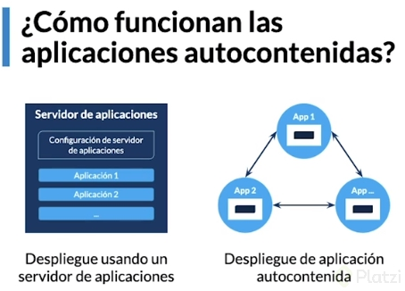

### ¿Qué es y qué usaremos de Spring?

Spring es el framework más usado de Java. Nos ofrece herramientas que nos permite crear proyectos más avanzados, con mejores prácticas y en menor tiempo. También posee una gran comunidad, lo que nos brinda muchísima documentación y ayuda.

Spring tiene una estructura modular y flexible, lo que nos hace usar solo lo que necesitemos.

Vamos a usar 4 subproyectos de Sping:

* Spring Framework: Permite crear aplicaciones empresariales. Es transversal, ya que todos lo usan.
* Spring Boot: Con el que podemos crear aplicaciones autocontenidas y autoconfigurables.
* Spring Data: Gestionar e integrar bases de datos.
* Spring Security: Gestionar la seguridad de la aplicación.

### Conocer qué es una aplicación autocontenida

Las arquitecturas modernas se basan de acuerdo a una aplicacion autocontenida
Cada aplicación internamente contiene su servidor de aplicaciones con su configuración totalmente independiente una de la otra en lugar de todas las aplicaciones centralizadas en un solo servidor

Spring Boot

* Es el proyecto de Spring para aplicaciones autocontenidas
* Olvidarnos de la infraestructura y centrarnos en el desarrollo
* Puede funcionar con Tomcat (por defecto), Jetty o Undertow.
*  Incluye gestión de dependencias iniciales, configuración automática y más





### Qué es Spring Initializr?

https://start.spring.io/

* Sitio oficial para generar un proyecto de Spring Boot
* En poco tiempo y a nuestra medida
* Con todo lo que necesitamos para empezar

Project:

Los projectos Maven gestionan las dependencias conarchivos XML
Los archivos Gradle son escritos en Groovy y permite crear tareas que se pueden ejecutar al momento de hacer despliegue o integración continua

Utilizar la version estable de spring boot y llenar los metadatos
* Spring Web: permite genera APIs rest utilizando Apache Tomcat como servidor por defecto
* build.gradle: Es donde etsta escrita toda la configuración del proyecto (plugins, version de Java, dependencias, software para pruebas etc.)
* Carpeta gradle: Archivos necesarios para que gradle funcione
* @SpringBootApplication: indica la clase que gestiona la aplicación

### Configurar Spring Boot

Propiedades de la aplicación

application.properties, application.yml o línea de comando 
○ (configurar un nuevo numero de puerto)

Posibilidad de añadir propiedades propias
```
server.port=8090
server.servlet.context-path=/market/api
localhost:8090/market/api/saludar/hola
```
Gestión de perfiles según el tipo de despliegue
(se puede utilizar para desplegar perfiles para dev y para prod)

* Ser gestionado para varios entornos
* Es muy importante seguir el patron den nombramiento

application.properties
	spring.profiles.active=dev
	server.servlet.context-path=/win-market/api
application-dev.properties
	server.port=8090
application-pdn.properties
	server.port=80

Common Application properties

https://docs.spring.io/spring-boot/docs/current/reference/html/appendix-application-properties.html


### Crear la estructura del proyecto

La estructura del proyecto será de la siguiente manera:

1. DOMINIO:

* DTO y objetos del dominio (Contexto de la aplicación)
* Servicios: Puente entre los controladores y la capa de persistencia.
* Especificación de repositorios: Interfaces que determinan las reglas que debe cumplir la persistencia para actuar entre los objetos de dominio y la DB.

2. WEB:

* Controladores de API Rest.

3. PERSISTENCIA:

* Repositorios: Implementan las especificaciones que tiene la capa de DOMINIO.
* Entities: Mapean y actúan como tablas de la DB.

/market/src/main/java/com/nestor/market

mkdir -p domain/{dto,repository,service} persistance/{entity,crud} web/controller

### ¿Qué es JPA?

Jpa es una especificación de Java, standar, para un framework ORM. Quiere decir que son uan serie de reglas que Java define para que cualquier framework que quierea interactura con la BD de Java, tenga que seguir.

Los frameworks mas populares de Java para este fin son:

* Hibernate
* TopLink
* EclipseLink
* ObjectDB

JPA utiliza anotaciones para conectar clases a tablas de la BD y asi evitar hacerlo de manera nativa con SQL.

* @Entity. Indica a una clase de java que esta representando una tabla de nuestra BD.
* @Table. Recibe el nombre de la tabla a la cual esta mapeando la clase.
* @column. Se le pone a los atributos de la clase, no es obligatoria, se indica sólo cuando el nombre de la columna es diferente al nombre del atributo de la tabla.
* @id amd @EmbededID. Es el atributo como clave primaria de la tabla dentro de la clase. @id se utiliza cuando es clave primaria sencilla y @EmbededID cuando es una clave primaria compuesta.
* @GeneratedValue. Permite generar automáticamente generar valores para las clases primarias en nuestras tablas en las clases
* @OneToMany and @MatyToOne. Representar relaciones como existen en las tablas, en las clases

### Spring Data


Spring Data NO es una implementacion de JPA, sino mas bien es un proyecto que usa JPA para ofrecer funcionalidaes extra en la gestion de tareas desde JAVA a las base de datos.

Spring Data internamente tiene varios subproyectos, entre ellos: Spring Data JPA y Spring Data JDBC, para conectarnos a BD relacionales (SQL). Spring Data MongoDB y Spring Data Cassandra, son proyectos para conectarnos a BD no relacionales.

La tarea principal de Spring Data es optimizar tareas repitivas.

Spring data nos provee de respositorios sin codigo, nos permiten hacer todo tipo de operaciones en BD (CRUD) sin utilizar una linea de código.

También nos provee de auditorías transparentes, por ello, posee un motor de auditorias que nos permite saber cuadno se insertó un registro, cuando se borró, cuando se actualizo en la BD, etc.

#### Implementación en el proyecto Market

Se busca en MAVEN el repositorio Spring Boot Starter Data JPA, se copia el group y el name en las dependencias del archivo build.gradle de nuestro proyecto quedando de la siguiente manera.

```java
dependencies {
    //Dependencia agregada
	implementation 'org.springframework.boot:spring-boot-starter-data-jpa'
	
    implementation 'org.springframework.boot:spring-boot-starter-web'
	testImplementation('org.springframework.boot:spring-boot-starter-test') {
		exclude group: 'org.junit.vintage', module: 'junit-vintage-engine'
	}
}
```


###

Cuando se tiene una tabla en la que su llave primara es compuesta, se debe hacer una clase aparte que contenga los atributos que conforman la llave

Creando la Clase que tendra nuestra llave compuesta
Recuerda que debe de contener lo siguiente:

* se le debe agregar la anotacion @Embeddable
* se debe de hacer un “implements Serializable”
* debe contener los atributos que conformen la llame compuesta
* como en la mayoria de entidades debemos crear los getter y setters


En la clase principal debemos tener:

* Declarar la variable id como el tipo de la clase que creamos de nuestra llave compuesta que en este caso es : “ComprasProductoPK”
* Agregarle la etiqueta @EmbeddeId que hace referencia a que es una llave compuesta y que esta dada por otra clase
* Y nuevamente los Getter y Setters

### Spring Data Repositories


Tres tipos de repositorios:

* CrudRepository: realizar el crue
* PagingAndSortingRepository: incluye lo de Crud repository ademas de paginación y ordenamiento.
* JPARepository: Ademas de tener CrudRepository y PagingAndSortingRepository nos permite tareas específicas como Flush.


### Query Methods

Los query method son muy potentes. Además de los explicado, permiten realizar múltiples operaciones de comparación con:

* Números: mayores, menores, iguales…
* Textos: contiene cierta porción de texto, empieza o termina con una porción de texto, ignora case sensitive…
* Fechas: Antes de cierta fecha, después de cierta fecha, entre cierta fecha…
* Joins entre entidades: Si tenemos una entidad que se relaciona con otra, es posible realizar “joins” con esa relación para tener queries más específicas según nuestra necesidad. Por ejemplo, si tengo una relación de Producto y Categoría y quiero tener todos los productos de cierta categoría podría hacer: findAllByCategoriasId(Integer categoriaId) y así poder llegar a esta relación. Esto puede mezclarse con múltiples relaciones en simultáneo
* Comparación entre un conjunto de datos: Si por ejemplo quiero traerme los productos con varias categorías, podría escribir findAllByCategoriasIdIn(List<Integer> categoriaIds); y así trabajar bajo un conjunto de Id de categorías

Existen más funcionalidades ✌🏼. Pueden ver más detalle acá: https://docs.spring.io/spring-data/jpa/docs/current/reference/html/#jpa.query-methods.query-creation


### Implementar la anotación @Repository

@Repository: le indicamos a la clase que es la encarga de interactuar con la base de datos.
@Component: le indicamos que es un componente de spring.

El primero es mejor porque indicamos el tipo de componente que es.

### ¿Qué es el patrón Data Mapper y qué resuelve?

DataMappers - Mapeando los datos

Nos permite desacoplar la persistencia de la aplicación. Consiste en convertir o traducir varios objetos que pueden cumplir la misma labor. De esta forma podemos:

* Independizar la base de datos de la API, desacoplanto la capa de persistencia o de negocio.
* Desacoplarnos de una base de datos puntua, así no tendríamos que refactorizar todo el código si la capa de persistencia cambia.
* Evitar campos innecesarios en la API.
* Evitar mezclar idiomas en la aplicación.
