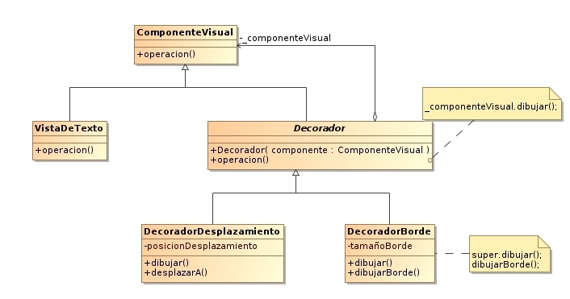

https://developer.mozilla.org/en-US/docs/Web/API/HTMLMediaElement
https://html.spec.whatwg.org/multipage/workers.html

En JavaScript no exiten las clases, lo que existen son objectos
Para agregar metodos a estas clases se agregan al prototype 

El DOM es la representación que hace el navegador de un documento HTML.

El navegador interpreta el archivo HTML y cuando termina de transformarlo al DOM se dispara el evento DOMContentLoaded lo que significa que todo el documento está disponible para ser manipulado.

Tanto con async como defer podemos hacer llamados asíncronos pero tiene sus diferencias:

async. Con async podemos hacer la petición de forma asíncrona y no vamos a detener la carga del DOM hasta que se haga la ejecución del código.

defer. La petición es igual asíncrona como en el async pero va a deferir la ejecución del Javascript hasta el final de que se cargue todo el documento.

scripts embebidos: el navgador carga linea a linea el html y cuando se encuentra un codigo entre scripts va a deter su ejecución hasta que hallá procesado todo el script.

Scope

El Scope o ámbito de una variable, es lo que define el tiempo de vida de una variable, en que partes de nuestro código pueden ser usadas.

Toda variable que se declare fuera una funcion, queda disponible en el scope global (window)

Global Scope Variables disponibles de forma global se usa la palabra var, son accesibles por todos los scripts que se cargan en la página. Aquí hay mucho riesgo de sobreescritura.

Function Scope Variables declaradas dentro de una función sólo visibles dentro de ella misma (incluyendo los argumentos que se pasan a la función).

Block Scope Variables definidas dentro de un bloque, por ejemplo variables declaradas dentro un loop while o for. Se usa (let y const) para declarar este tipo de variables.

Module Scope(Babel) Cuando se denota un script de tipo module con el atributo type="module las variables son limitadas al archivo en el que están declaradas. no los vamos a poder leer 
en consola porque el module scope está limitando el alcance

Clouseres **

clouseres o clausuras es la union del scope y funciones, Establecer valores definidos y crear nuevas funciones para trabajar sobre estos valores

This

This se refiere a un objeto. Ese objeto es el que actualmente está ejecutando un pedazó de código.

this en el objeto global -> window

Métodos Call, Apply y Bind

This no es un valor que podemos asignar directamente, no podemos escribir this = 'valor', pero si existen unos métodos que son parte del prototipo de function (call, apply, bind).Estos 3 métodos nos van ha ayudar a establecer cual es el this que va ha ser el contexto de la llamada a una función .

Todas las funciones tienen (call, apply, bind)

Call - comma
Apply - arreglo

bind no va a llamar la función automáticamente sino que va a construir una nueva función, está nueva función va a tener el this que le pasamos ya integrado y cuando llamemos ha está nueva función se va a ejecutar.

Call y Apply van a establecer el this y va a llamar la función inmediatamente, bind va a crear una nueva función donde this estará guardado y luego tocará guardar y ejecutar esa nueva función.

Prototype **

La regla que usa new cuando hace el Object.create es que siempre va a sacar el prototype de lo que sea el constructor

Herencia Prototipal **

Por default los objetos en JavaScript tienen cómo prototipo a Object que es el punto de partida de todos los objetos, es el prototipo padre. Object es la raíz de todo, por lo tanto tiene un prototipo padre undefined.

Cuando se llama a una función o variable que no se encuentra en el mismo objeto que la llamó, se busca en toda la prototype chain hasta encontrarla o regresar undefined.

La función hasOwnProperty sirve para verificar si una propiedad es parte del objeto o si viene heredada desde su prototype chain.
SomeObject.prototype es un objeto donde definimos el prototipo de las instancias de SomeObject. Es decir, las instancias de SomeObject van a "heredar" de SomeObject.prototype.
SomeObject.[[Prototype]] es el prototipo de SomeObject. Es decir, SomeObject "hereda" de SomeObject.prototype.

¿Qué pasa cuando llega un script al navegador?

Reciben un código fuente lo analizan y lo deconstruyen en el AST(Abstract Syntax Tree). Esté AST lo toma un interpretador y lo convierte en bytecode que es lo que se va a ejecutar, el programa va a empezar ejecutando bytecode y eventualmente va a tener suficiente información para ejecutar machine code que es el mismo código pero automizado.

Que hace un JS Engine?

-recibe código fuente,
-Parsea código y produce Abstract Syntax Tree(AST)
-Se compila a bytecode y se ejecuta.
-Se optimiza a machine code y se remplaza el código base.


Javascript source code pasa por el parset donde obtenesmos el AST, despues el AST se lo damos al interpretador que va a producir bytecode ahí es donde comienza a ejecutarse nuestro programa, bytecode es un lenguaje menor nivel pero va a permitir que se ejecute más rápido, mientras se va ejecutando hay un proceso que se llama el profiling data que va a estar analizando la ejecución va a encontrar los puntos donde el programa se puede optimizar y eventualemente va a producir el machine code, esto hace el optimizing compiler* el compilador de optimizaciones y despues tenemos el Optimized code.

Parser: un parser va a tomar tu código fuente y lo va a leer lo descompone salen en tokens. 

Tokens identifican que let es una palabra clave o new es una palabra clave, que el simbolo de + es un operador y que lo que está aun lado y al otro o quizas son número u otro tipo de variable y una vez que tenemos esos tokens es cuando vamos a hacer el AST(Abstract Syntax Tree).

Google dice:

Parsing es 15% - 20% del proceso de ejecución.
La mayoría del Javascript en una página nunca se ejecuta.
Esto hace que bundling y code splitting sea muy importante

Eager Parsing

Arquitectura en forma de árbol que representa tu programa, construye los scopes. En este momento vamos a saber que variables se pueden leer en que partes del código

Encuentrar errores de sintaxis
Crea el AST
Construye Scopes

Lazy Parsing

estamos retrazando alguna parte del código porque no hace falta analizarla y puede esperar,


Doble de rápido que el eager parser
No crea el AST
Construye los scopes parcialmente.

Tokens

https://esprima.org/demo/parse.html

Parser produce Abstract Syntax Tree

Abstract Syntax Tree

El AST (Abstract Syntax Tree "estructura en forma de árbol"). Donde vamos a tener una raíz que será nuestro programa y lo vamos a ir descomponiendo en partes, todo esto lo vamos a poder hacer siguiendo los tokens que produce el parser, también se usa  para transformar código de una forma a otra que es como lo que hace babel o priged

Se usa en:

Javascript Engine
Bundlers: Webpack, Rollup, Parcel
Transpilers: Babel
Linters: ESLint, Prettify
Type Checkers: TypeScript, Flow
Syntax Highlighters

Demo de AST
https://astexplorer.net/


Usaremos el AST para crear una regla para Eslint, que analiza estáticamente nuestro código para ver si encuentra errores o si hay que leventar warnings porque estamos violando alguna regla de estilo o simplemente nuestro código esta vilolando la sintaxis del lenguaje, muchas de estas reglas ya vienen con Eslint pero también podemos desarrollar nuevas, para hacer eso vamos a desarrollar una herramienta que se llama AST Explorer En esté explorer tenemos que asegurarnos que la configuración es la correcta, si aquí no dice babel-eslint vamos a seleccionarla y vamos a ver como vamos a transformar el código. En esté caso lo vamos a procesar y vamos usar la última versión de eslint v4.


Código al que queremos establecer reglas:
```js
const pi = 3.1415;
const halft_pi = 1.356;

// Variables constantes
// Variables que guarden un número 

// El nombre de la variable tiene que estar en UPPER CASE
```

Reglas que establecemos para el código usando EsLint
```js
export default function(context) {
  return {
  	VariableDeclaration(node) {
    	// Tipo de variable const
      if(node.kind === "const") {
      	const declaration = node.declarations[0];
        // asegurarnos que el valor es un número  
        if(typeof declaration.init.value === "number") {
        	if(declaration.id.name !== declaration.id.name.toUpperCase()) {
            	context.report({
                	node: declaration.id,
                    message: "El nombre de la constante debe estar en Mayúsculas",
                    //arreglar el error 
                  	fix: function(fixer) {
                    	return fixer.replaceText(declaration.id, declaration.id.name.toUpperCase());
                    }
                })
            }
        }
      }
    }
  };
};
```


Despues de que el parser hizo su trabajo y nos dio el AST continua el interpretador, el compilador para obtener código optimizado.

Recibe código fuente
Parsea el código y produce un Abstract Syntax Tree(AST)
Se compila a bytecode
Se optimiza a machine code y se remplaza el código base.

El bytecode es algo parecido a assembly y assembly es un lenguaje de muy bajo nivel pero que aún se puede escribir, son palabras clave que le dicen al procesador que hacer. Es similar a Assembly excepto que en lugar de operar sobre un procesador va a operar sobre algo que se llama la virtual machine que es un programa que ejecuta bytecode.

El Machine Code es código binario,

Cuando el motor de Javascript V8 que es el que ocupa chrome y node, produce esté código va a crearlo a machine code ya el bytecode que corre la máquina virtual no se va a ocupar.

El profiler es un programa que esta en medio del bytecode y el optimizador, este programa lo que hace es que toma una observación de la ejecución del bytecode y cuando ve que las funciones se estan llamando igual, una vez tras otra y todas la llamadas son iguales

Event Loop

El eventLoop es lo que hace que javascript parezca ser multihilo cuando realmente es un solo hilo, entonces como rayos es que podemos hacer scroll, click, cargar un imagen, hacer una petición, miles de cosas haciendo eso una sola vez.


Tenemos que saber que Javascript se organiza usando 2 estructuras de datos, es el Stack y el Heap.

el memory heap es una estructura desorganizada, en el stack hay un orden,una función dentro de una función, una dentro de otra, el memory Heap es completamente aleatoria y ahí es donde se guarda la información de las 
variables, el scope, etc.

El stack es donde están nuestras funciones, es el registro de como esta operando nuestro programa, apunta a variables como el scope.

En el Queue lo primero que entra es lo primero que sale,

las promesas van en otra cola, la cola de microtareas Microtask Queue. Las microtareas son de mayor preoridad y seimpre van primero sobre el scheduled task.

Promesas

Todas las funciones asyn regresa una promesa
o usar trycatch para esperar que una promesa se resulva o se rechace
.all() todas las promesas resuelvan si una promesa tiene error todo lo demas tiene error 
.race() de una lista de promesas la primera que se cumpla es la que regresa (No siempre la primera que esta en la lista es la que regresa)

Getters y Setters **

son funciones que podemos utilizar dentro de objetos que nos permiten tener propiedades virtuales

```js
const person = {
  firstName = 'Nestor,
  lastName = 'Monroy',
  get fullName() {
    return `${person.firstName }  ${person.lastName }`
  },
  set fullName(){
    const parts = value.split('');
    this.firstName = parts[0];
    this.lastName = parts[1]
  }
};

person.fullName = 'Joel Hernandez';
console.log(person)

```

Proxy **

https://developer.mozilla.org/es/docs/Web/JavaScript/Referencia/Objetos_globales/Proxy


Methods of the handler object (métodos del objeto manejador). Aquí vamos a encontrar a get y set, decimos que son trampas, cuando hay una llamada, la llamada va a caer en estas trampas si las tenemos definidas, en la trampa de get y de set, también hay trampas para ver el getPrototypeOf, handler.apply, handler.constructor, etc.

Generadores

Los generadores son funciones especiales cuya ejecución podemos comenzar y detener a mitad de vuelo y cuando queramos continuarla podemos llamar a next, podemos pasarle un valor al generador si hace falta y su ejecución va a continuar siempre recordanse del scope en el que estaba.


Como cancelar peticiones Fetch

Con fetch tenemos algo llamado AbortController que nos permite enviar una señal a una petición en plena ejecución para detenerla.

AbortController nos va ha dar 2 controllers para poder detener una ejecución en este caso va ha ser la del fetch, la cual es una clase que trae el motor de javascript, la cual tenemos que instanciarla.

Intersection Observer API

https://developer.mozilla.org/es/docs/Web/API/IntersectionObserverEntry

La API Observador de Intersección, provee una vía para, de forma asíncrona, observar cambios en la intersección de un elemento con un elemento ancestro o con el viewport del documento de nivel superior.

La información sobre intersección es necesaria por muchas razones, tales como:

Lazy-loading de imágenes u otro contenido a medida que la página se desplaza. Implementación de “scroll infinito” de sitios web, donde más y más contenido se carga y muestra a medida que usted hace scroll, de forma que el usuario no tiene que pasar páginas. I


root

El elemento que es usado como viewport para comprobar la visibilidad de elemento target. Debe ser un elemento ascendiente del target. Por defecto se toma el viewport del navegador si no se especifica o si se especifica como null.

rootMargin

Margen alrededor del elemeto root. Puede tener valores similares a los de CSS margin property, e.g. "10px 20px 30px 40px" (top, right, bottom, left). Los valores pueden ser porcentajes. Este conjunto de valores sirve para aumentar o encoger cada lado del cuadro delimitador del elemento root antes de calcular las intersecciones. Por defecto son todos cero.

threshold

Es un número o un array de números que indican a que porcentaje de visibilidad del elemento target, la función callback del observer debería ser ejecutada. Si usted quiere que se detecte cuando la visibilidad pasa la marca del 50%, debería usar un valor de 0.5. Si quiere ejecutar la función callback cada vez que la visibilidad pase otro 25%, usted debería especificar el array [0, 0.25, 0.5, 0.75, 1]. El valor por defecto es 0 (lo que significa que tan pronto como un píxel sea visible, la función callback será ejecutada). Un valor de 1.0 significa que el umbral no se considera pasado hasta que todos los pixels son visibles.

Visibility Change

https://developer.mozilla.org/es/docs/Web/API/Page_Visibility_API

El evento visibilityChange es un evento muy simple pero muy util, nos deja saber si el tab es el que esta hasta el frente, el tab que el usuario esta viendo, si cambiamos de tab nos permite cambiar acción, no solo nos permite ver un video, también pudiera ser cambiar el titulo de la pestaña, y asi decirle al dom que haga otras acciones, que pueden ahorrar bateria o mejorar el rendimiento de nuestras aplicaciones.

El documento DOM ahora tiene un elemento que podemos escuchar.

```js
document.addEventListener('visibilitychange', () => {
  console.log(document.visibilityState);
})

```

Service worker

services workers es una capa que va a vivir entre el navegador y el internet. Lo que van a hacer es algo parecido a los proxys, van a interceptar peticiones, en esté caso las peticiones vamos a tener la oportunidad de hagarrar la petición, buscar la respuesta pero antes de regresarla al browser la vamos a guardar en cache


Typescript

TypeScript es un superset de JavaScript que añade tipos a nuestras variables ayudando así a la detección de errores de forma temprana y mejorando el autocompletado.

TypeScript es un lenguaje de programación libre y de código abierto desarrollado y mantenido por Microsoft. Es un superconjunto de JavaScript, que esencialmente añade tipos estáticos y objetos basados en clases. Anders Hejlsberg, diseñador de C# y creador de Delphi y Turbo Pascal, ha trabajado en el desarrollo de TypeScript.1​ TypeScript puede ser usado para desarrollar aplicaciones JavaScript que se ejecutarán en el lado del cliente o del servidor (Node.js).


En Javascript las funciones toman argumentos y pudieran regresar algun valor. En Typescript podemos ser explicitos de como deben ser esos argumentos y también podemos proveer información de cual es valor que debe regresar la función.

Las interfaces definen la forma exacta que debe tener un objeto, no podemos añadir propiedades de más, ni de menos, en caso de que una propiedad sea opcional, la tenemos que marcar como opcional


Clases en Typescript

JavaScript tradicional utiliza funciones y herencia basada en prototipos para construir componentes reutilizables, pero esto puede resultar un poco incómodo para los programadores más cómodos con un enfoque orientado a objetos, donde las clases heredan la funcionalidad y los objetos se crean a partir de estas clases. A partir de ECMAScript 2015, también conocido como ECMAScript 6, los programadores de JavaScript podrán construir sus aplicaciones utilizando este enfoque basado en clases orientado a objetos. En TypeScript, permitimos que los desarrolladores usen estas técnicas ahora y las compilen en JavaScript que funcione en todos los principales navegadores y plataformas, sin tener que esperar a la próxima versión de JavaScript.

Patrones de diseño ** 

https://every-layout.dev/
https://mediaqueri.es/

https://blog.codinghorror.com

books 

http://www.uml.org.cn/c++/pdf/DesignPatterns.pdf
https://arl.human.cornell.edu/linked%20docs/Alexander_A_Pattern_Language.pdf
http://library.uniteddiversity.coop/Ecological_Building/The_Timeless_Way_of_Building_Complete.pdf


Los patrones de diseño son unas técnicas para resolver problemas comunes en el desarrollo de software y otros ámbitos referentes al diseño de interacción o interfaces.

Un patrón de diseño resulta ser una solución a un problema de diseño. Para que una solución sea considerada un patrón debe poseer ciertas características. Una de ellas es que debe haber comprobado su efectividad resolviendo problemas similares en ocasiones anteriores. Otra es que debe ser reutilizable, lo que significa que es aplicable a diferentes problemas de diseño en distintas circunstancias.

Sumary: Los patrones de diseño son como recetas que resuelven problemas que nos enfrentamos frecuentemente en el diseño de software, en especifico, son una solución de un problema dentro de un contexto, y esté contexto no se vale que ocurra una sola vez, tiene que pasar muchas veces. Porque si ocurriera una sola vez, fuera una solución pero no lo podemos categorizar como un patrón de diseño, los patrones de diseño van a resolver problemas dentro de un contexto recurrente.

Objetivos de los patrones de diseño

Los patrones de diseño pretenden:

Proporcionar catálogos de elementos reusables en el diseño de sistemas software.
Evitar la reiteración en la búsqueda de soluciones a problemas ya conocidos y solucionados anteriormente.
Formalizar un vocabulario común entre diseñadores.
Estandarizar el modo en que se realiza el diseño.
Facilitar el aprendizaje de las nuevas generaciones de diseñadores condensando conocimiento ya existente.

Asimismo, no pretenden:

Imponer ciertas alternativas de diseño frente a otras.
Eliminar la creatividad inherente al proceso de diseño.

No es obligatorio utilizar los patrones, solo es aconsejable en el caso de tener el mismo problema o similar que soluciona el patrón, siempre teniendo en cuenta que en un caso particular puede no ser aplicable. "Abusar o forzar el uso de los patrones puede ser un error".


El libro design patterns de GoF definio la lita inicial de patrones de diseño de software, los dividio en 3 categorias:

Patrones creacionales
Patrones estructurales
Patrones de comportamiento


Patrones Creacionales

Proveen diferentes mecanismos para crear objetos. Nos ayudan a encapsular y abstraer dicha creación:

[Object Pool](https://es.wikipedia.org/wiki/Object_pool_(patr%C3%B3n_de_dise%C3%B1o)) (Pisicina de objetos): no pertenece a los patrones especificados por GoF): se obtienen objetos nuevos a través de la clonación. Utilizado cuando el costo de crear una clase es mayor que el de clonarla. Especialmente con objetos muy complejos. Se especifica un tipo de objeto a crear y se utiliza una interfaz del prototipo para crear un nuevo objeto por clonación. El proceso de clonación se inicia instanciando un tipo de objeto de la clase que queremos clonar.

[Abstract Factory](https://es.wikipedia.org/wiki/Abstract_Factory) (fábrica abstracta): permite trabajar con objetos de distintas familias de manera que las familias no se mezclen entre sí y haciendo transparente el tipo de familia concreta que se esté usando. El problema a solucionar por este patrón es el de crear diferentes familias de objetos, como por ejemplo, la creación de interfaces gráficas de distintos tipos (ventana, menú, botón, etc.).

[Builder](https://es.wikipedia.org/wiki/Builder_(patr%C3%B3n_de_dise%C3%B1o)) (constructor virtual): abstrae el proceso de creación de un objeto complejo, centralizando dicho proceso en un único punto.

Es usado para permitir la creación de una variedad de objetos complejos desde un objeto fuente. Es como si tenemos un punto de partida que es esté objeto y vamos a poder tomar varios caminos dependiendo de cuales funciones o métodos llamemos.

Separa la creación de objeto complejo de su estructura, de tal forma que el mismo proceso de construcción puede servir para crear representaciones diferentes.

[Factory Method](https://es.wikipedia.org/wiki/Factory_Method_(patrón_de_diseño)) (método de fabricación): centraliza en una clase constructora la creación de objetos de un subtipo de un tipo determinado, ocultando al usuario la casuística, es decir, la diversidad de casos particulares que se pueden prever, para elegir el subtipo que crear. Parte del principio de que las subclases determinan la clase a implementar. A continuación se muestra un ejemplo de este patrón:

```java
class ConcreteCreator extends Creator{
    protected Product factoryMethod(){
        return new ConcreteProduct();
    }
}

interface Product{...}

class ConcreteProduct implements Product{...}

public class Client{
    public static void main(String args[])
    {
        Creator unCreator = new ConcreteCreator();
        unCreator.factoryMethod();
    }
}
```

[Prototype](https://es.wikipedia.org/wiki/Prototipo_(patr%C3%B3n_de_dise%C3%B1o)) (prototipo): crea nuevos objetos clonándolos de una instancia ya existente.

[Singleton](https://es.wikipedia.org/wiki/Singleton) (instancia única): garantiza la existencia de una única instancia para una clase y la creación de un mecanismo de acceso global a dicha instancia. Restringe la instanciación de una clase o valor de un tipo a un solo objeto. A continuación se muestra un ejemplo de este patrón:

ejemplo en Java:

```java
public sealed class Singleton
{
    private static volatile Singleton instance;
    private static object syncRoot = new Object();
    private Singleton()
    {
        System.Windows.Forms.MessageBox.Show("Nuevo Singleton");
    }
    public static Singleton GetInstance
    {
        get
        {
            if (instance == null)
            {
                lock(syncRoot)
                {
                    if (instance == null)
                    instance = new Singleton();
                }
            }
            return instance;
        }
    }
}
```

[Model View Controller](https://es.wikipedia.org/wiki/Modelo%E2%80%93vista%E2%80%93controlador) (MVC) ♙En español: Modelo Vista Controlador. Es un patrón de arquitectura de software que separa los datos y la lógica de negocio de una aplicación de la interfaz de usuario y el módulo encargado de gestionar los eventos y las comunicaciones. Este patrón plantea la separación del problema en tres capas: la capa model, que representa la realidad; la capa controller , que conoce los métodos y atributos del modelo, recibe y realiza lo que el usuario quiere hacer; y la capa vista, que muestra un aspecto del modelo y es utilizada por la capa anterior para interactuar con el usuario.

Patrones estructurales

Describen formas de componer  objetos para formar nuevas estructuras flexibles y eficientes.

- [Adapter o Wrapper](https://es.wikipedia.org/wiki/Adaptador_(patr%C3%B3n_de_dise%C3%B1o)) (Adaptador o Envoltorio): Adapta una interfaz para que pueda ser utilizada por una clase que de otro modo no podría utilizarla.
- [Bridge](https://es.wikipedia.org/wiki/Bridge_(patrón_de_diseño)) (Puente): Desacopla una abstracción de su implementación.
- [Composite](https://es.wikipedia.org/wiki/Composite_(patr%C3%B3n_de_dise%C3%B1o)) (Objeto compuesto): Permite tratar objetos compuestos como si de uno simple se tratase.
- [Decorator](https://es.wikipedia.org/wiki/Decorator_(patr%C3%B3n_de_dise%C3%B1o)) (Decorador): Añade funcionalidad a una clase dinámicamente.
- [Facade](https://es.wikipedia.org/wiki/Facade_(patr%C3%B3n_de_dise%C3%B1o)) (Fachada): Provee de una interfaz unificada simple para acceder a una interfaz o grupo de interfaces de un subsistema.
- [Flyweight](https://es.wikipedia.org/wiki/Flyweight_(patr%C3%B3n_de_dise%C3%B1o)) (Peso ligero): Reduce la redundancia cuando gran cantidad de objetos poseen idéntica información.
- [Proxy](https://es.wikipedia.org/wiki/Proxy_(patr%C3%B3n_de_dise%C3%B1o)): Proporciona un intermediario de un objeto para controlar su acceso.
- [Module](https://es.wikipedia.org/wiki/M%C3%B3dulo_(patr%C3%B3n_de_dise%C3%B1o)): Agrupa varios elementos relacionados, como clases, singletons, y métodos, utilizados globalmente, en una entidad única.


Patrones de comportamiento

Gestionan algoritmos y responsabilidades. Estos patrones lo que ofrecen son formas de poder manejar diferentes algoritmos, funcionalidades que pueden llegar a tener tus objetos o las relaciones entre ellos.

Se definen como patrones de diseño software que ofrecen soluciones respecto a la interacción y responsabilidades entre clases y objetos, así como los algoritmos que encapsulan:

[Chain of Responsibility](https://es.wikipedia.org/wiki/Cadena_de_responsabilidad) (Cadena de responsabilidad): Permite establecer la línea que deben llevar los mensajes para que los objetos realicen la tarea indicada.
[Command](https://es.wikipedia.org/wiki/Command_(patr%C3%B3n_de_dise%C3%B1o)) (Orden): Encapsula una operación en un objeto, permitiendo ejecutar dicha operación sin necesidad de conocer el contenido de la misma.
[Interpreter](https://es.wikipedia.org/wiki/Interpreter_(patr%C3%B3n_de_dise%C3%B1o)) (Intérprete): Dado un lenguaje, define una gramática para dicho lenguaje, así como las herramientas necesarias para interpretarlo.
[Iterator](https://es.wikipedia.org/wiki/Iterador_(patr%C3%B3n_de_dise%C3%B1o)) (Iterador): Permite realizar recorridos sobre objetos compuestos independientemente de la implementación de estos.
[Mediator](https://es.wikipedia.org/wiki/Mediator_(patr%C3%B3n_de_dise%C3%B1o)) (Mediador): Define un objeto que coordine la comunicación entre objetos de distintas clases, pero que funcionan como un conjunto.
[Memento](https://es.wikipedia.org/wiki/Memento_(patr%C3%B3n_de_dise%C3%B1o)) (Recuerdo): Permite volver a estados anteriores del sistema.
[Observer](https://es.wikipedia.org/wiki/Observer_(patr%C3%B3n_de_dise%C3%B1o)) (Observador): Define una dependencia de uno-a-muchos entre objetos, de forma que cuando un objeto cambie de estado se notifique y actualicen automáticamente todos los objetos que dependen de él.
[State](https://es.wikipedia.org/wiki/State_(patr%C3%B3n_de_dise%C3%B1o)) (Estado): Permite que un objeto modifique su comportamiento cada vez que cambie su estado interno.
[Strategy](https://es.wikipedia.org/wiki/Strategy_(patr%C3%B3n_de_dise%C3%B1o)) (Estrategia): Permite disponer de varios métodos para resolver un problema y elegir cuál utilizar en tiempo de ejecución.
[Template Method](https://es.wikipedia.org/wiki/Patr%C3%B3n_de_m%C3%A9todo_de_la_plantilla) (Método plantilla): Define en una operación el esqueleto de un algoritmo, delegando en las subclases algunos de sus pasos, esto permite que las subclases redefinan ciertos pasos de un algoritmo sin cambiar su estructura.
[Visitor](https://es.wikipedia.org/wiki/Visitor_(patr%C3%B3n_de_dise%C3%B1o)) (Visitante): Permite definir nuevas operaciones sobre una jerarquía de clases sin modificar las clases sobre las que opera.


Patrón Singleton y casos de uso

Singleton es un patron creacional, el singleton te va ayudar a que una clase solo sea capaz de crear una sola instancia de si misma, esa instancia siempre va a ser la misma, para describir patrones de diseño, siempre usamos una notación que se llamá UML.

Diagrama UML de una clase que implementa el patrón singleton.


En ingeniería de software, singleton o instancia única es un patrón de diseño que permite restringir la creación de objetos pertenecientes a una clase o el valor de un tipo a un único objeto.

Su intención consiste en garantizar que una clase solo tenga una instancia y proporcionar un punto de acceso global a ella.

El patrón singleton se implementa creando en nuestra clase un método que crea una instancia del objeto solo si todavía no existe alguna. Para asegurar que la clase no puede ser instanciada nuevamente se regula el alcance del constructor (con modificadores de acceso como protegido o privado).

El patrón singleton se implementa creando en nuestra clase un método que crea una instancia del objeto solo si todavía no existe alguna. Para asegurar que la clase no puede ser instanciada nuevamente se regula el alcance del constructor (con modificadores de acceso como protegido o privado).

La instrumentación del patrón puede ser delicada en programas con múltiples hilos de ejecución. Si dos hilos de ejecución intentan crear la instancia al mismo tiempo y esta no existe todavía, solo uno de ellos debe lograr crear el objeto. La solución clásica para este problema es utilizar exclusión mutua en el método de creación de la clase que implementa el patrón.

Las situaciones más habituales de aplicación de este patrón son aquellas en las que dicha clase controla el acceso a un recurso físico único (como puede ser el ratón o un archivo abierto en modo exclusivo) o cuando cierto tipo de datos debe estar disponible para todos los demás objetos de la aplicación.

El patrón singleton provee una única instancia global gracias a que:

La propia clase es responsable de crear la única instancia.
Permite el acceso global a dicha instancia mediante un método de clase.
Declara el constructor de clase como privado para que no sea instanciable directamente.
Al estar internamente autoreferenciada, en lenguajes como Java, el recolector de basura no actúa.


Implementación del patrón Singleton con Typescript

Uno de los patrones de diseño de creación más populares es el patrón Singleton que restringe la creación de instancias de una clase a un objeto.

En esta publicación, le mostraré cómo usar el patrón junto con TypeScript.


La biblia de los patrones de diseño, a saber, el libro de Gang of Four (GoF), presenta la aplicación de patrones utilizando el lenguaje C ++, un lenguaje estáticamente tipado.

TypeScript permite implementar el patrón Singleton gracias a las siguientes características:

- soporte para modificadores de acceso (privado, protegido, público),
- soporte para métodos estáticos,
- siendo un lenguaje estáticamente escrito.

```ts
class Singleton {
  private static instance: Singleton;
  private constructor() {
    // initialition
  }

  static getInstance() {
    if (!Singleton.instance) {
      Singleton.instance = new Singleton();
    }

    return Singleton.instance;
  }
}

export default Singleton;
```
Luego podemos crear instancias de Singleton que harán referencia al mismo objeto en memoria.

```ts
import Singleton from './Singleton';

const a = Singleton.getInstance();
const b = Singleton.getInstance();

console.log("¿A es igual a B?", a === b);
```

 Observer (patrón de diseño)

Observador (en inglés:[ Observer](https://en.wikipedia.org/wiki/Observer_pattern)) es un [patrón de diseño](https://es.wikipedia.org/wiki/Patr%C3%B3n_de_dise%C3%B1o) de software que define una dependencia del tipo uno a muchos entre objetos, de manera que cuando uno de los objetos cambia su estado, notifica este cambio a todos los dependientes. Se trata de un patrón de comportamiento (existen de tres tipos: creación, estructurales y de comportamiento), por lo que está relacionado con algoritmos de funcionamiento y asignación de responsabilidades a [clases](https://es.wikipedia.org/wiki/Clase_(inform%C3%A1tica)) y [objetos](https://es.wikipedia.org/wiki/Objeto_(programaci%C3%B3n)).

Los patrones de comportamiento describen no solamente estructuras de relación entre objetos o clases sino también esquemas de comunicación entre ellos y se pueden clasificar en función de que trabajen con clases (método plantilla) u objetos (cadena de responsabilidad, comando, iterador, recuerdo, observador, estado, estrategia, visitante).

La variación de la encapsulación es la base de muchos patrones de comportamiento, por lo que cuando un aspecto de un programa cambia frecuentemente, estos patrones definen un objeto que encapsula dicho aspecto. Los patrones definen una clase abstracta que describe la encapsulación del objeto.

Este patrón también se conoce como el patrón de publicación-inscripción o modelo-patrón. Estos nombres sugieren las ideas básicas del patrón, que son: el objeto de datos, que se le puede llamar Sujeto a partir de ahora, contiene atributos mediante los cuales cualquier objeto observador o vista se puede suscribir a él pasándole una referencia a sí mismo. El Sujeto mantiene así una lista de las referencias a sus observadores. Los observadores a su vez están obligados a implementar unos métodos determinados mediante los cuales el Sujeto es capaz de notificar a sus observadores suscritos los cambios que sufre para que todos ellos tengan la oportunidad de refrescar el contenido representado. De manera que cuando se produce un cambio en el Sujeto, ejecutado, por ejemplo, por alguno de los observadores, el objeto de datos puede recorrer la lista de observadores avisando a cada uno. Este patrón suele utilizarse en los [entornos de trabajo](https://es.wikipedia.org/wiki/Framework) de interfaces gráficas orientados a objetos, en los que la forma de capturar los eventos es suscribir listeners a los objetos que pueden disparar eventos.

Objetivo

Definir una dependencia uno a muchos entre objetos, de tal forma que cuando el objeto cambie de estado, todos sus objetos dependientes sean notificados automáticamente. Se trata de desacoplar la clase de los objetos clientes del objeto, aumentando la modularidad del lenguaje, creando las mínimas dependencias y evitando bucles de actualización (espera activa o sondeo). En definitiva, normalmente, se usará el patrón observador cuando un elemento quiere estar pendiente de otro, sin tener que estar comprobando de forma continua si ha cambiado o no.


Motivación

Si se necesita consistencia entre clases relacionadas, pero con independencia, es decir, con un bajo [acoplamiento](https://es.wikipedia.org/wiki/Acoplamiento_(inform%C3%A1tica)).


El patrón observador es la clave del patrón de arquitectura Modelo Vista Controlador (MVC).1​ De hecho el patrón fue implementado por primera vez en el MVC de Smalltalk basado en un entorno de trabajo de interfaz.2​ Este patrón está implementado en numerosos bibliotecas y sistemas, incluyendo todos los toolkits de GUI.

Patrones relacionados: publicador-subscriptor, mediador, singleton.

Participantes

Habrá sujetos concretos cuyos cambios pueden resultar interesantes a otros y observadores a los que al menos les interesa estar pendientes de un elemento y en un momento dado, reaccionar ante sus notificaciones de cambio. Todos los sujetos tienen en común que un conjunto de objetos quieren estar pendientes de ellos. Cualquier elemento que quiera ser observado tiene que permitir indicar:

1. "Estoy interesado en tus cambios".
1. "Ya no estoy interesado en tus cambios".

El observable tiene que tener, además, un mecanismo de aviso a los interesados. A continuación se detallan a los participantes de forma desglosada:

**Sujeto (subject):**
El sujeto proporciona una interfaz para agregar (attach) y eliminar (detach) observadores. El Sujeto conoce a todos sus observadores.

**Observador (observer):**
Define el método que usa el sujeto para notificar cambios en su estado (update/notify).
**Sujeto concreto (concrete subject):**
Mantiene el estado de interés para los observadores concretos y los notifica cuando cambia su estado. No tienen porque ser elementos de la misma jerarquía.

**Observador concreto (concrete observer):**
Mantiene una referencia al sujeto concreto e implementa la interfaz de actualización, es decir, guardan la referencia del objeto que observan, así en caso de ser notificados de algún cambio, pueden preguntar sobre este cambio.

Es uno de los patrones más utilizados, algunos ejemplos típicos son

- Newsletter
- Sockets
- Listeners en páginas web

Implicaciones sobre Observer

**Problema 1:**

Para evitar que el observador concreto tenga una asociación con el sujeto concreto, se podría hacer que la relación entre sujeto y observador fuese bidireccional, evitando así asociaciones concretas, el problema es que dejaría de ser una interfaz. El que deje de ser una interfaz puede producir problemas si el lenguaje de programación no soporta la [herencia múltiple](https://es.wikipedia.org/wiki/Herencia_m%C3%BAltiple).

Se podría eliminar la bidireccionalidad de la asociación pasando el sujeto como parámetro al método actualizar y ya no se tendría que referenciar el objeto observado. Esto podría causar problemas si se observan varios objetos, tanto de la misma clase como de distintas, ya que no elimina dependencias, y para hacer operaciones específicas sobre el objeto actualizado obliga a hacer en la implementación.

**Problema 2:**
Si hay muchos sujetos sin observador, la estructura de los observadores está desaprovechada, para solucionarlo se puede tener un intermediario que centralice el almacenamiento de la asociación de cada sujeto con sus observadores. Para esta solución se crea ese gestor de observadores usando el patrón [singleton](https://es.wikipedia.org/wiki/Singleton) (instancia única), ya que proporciona una única referencia y no una por cada sujeto. El gestor aunque mejora el aprovechamiento del espacio, hace que se reduzca el rendimiento y se pierde eficiencia en el método notificar.

**Problema 3:**
El responsable de iniciar la comunicación es el sujeto concreto, pero se puede dar un problema cuando el objeto concreto está siendo actualizado de forma continua ya que debido a esto se tendría que realizar muchas actualizaciones en muy poco tiempo. La solución sería suspender temporalmente las llamadas al método de actualización/notificación; por ejemplo, haciendo que el cliente pueda activar o desactivar las notificaciones y notificar todos los cambios cuando las vuelva a habilitar. El patrón Estado sería una posible solución para diseñar esta variante de no notificar si no se han dado cambios o hacerlo en caso de que si.

**Problema 4 (referencias inválidas):**
A la hora de implementar este patrón se debe tener cuidado cuando un elemento observable desaparece. En ciertos lenguajes será el gestor de memoria el que cada cierto tiempo debe de limpiar las referencias liberadas, pero si un observable que sigue siendo observado puede no liberarse nunca. Para solucionar este problema puede crearse una función destruir que notifique al gestor que el elemento observable va a desaparecer y si no se está usando la variante del gestor el observable directamente desregistrará a sus observadores. Antes de esto hay que eliminar las referencias a este elemento, por tanto, hay que eliminar a los observadores antes de eliminar al observable, ya que así se evitará tanto que aparezcan referencias inválidas al objeto una vez este haya sido eliminado, como que se produzcan operaciones inválidas intentando invocarlo.

Se puede avisar a los observadores creando un método actualizar especial, en el que se tendrían dos opciones:

1. El observador también muere.
2. El observador sigue vivo, pero apunta a nulo.

**Problema 5:**
Ya que se debe asegurar la consistencia del estado del sujeto antes de iniciar una notificación, siempre se notificará al final, ya que aunque en entorno multihilo se notifica antes de hacer los cambios, puede que los observadores soliciten información al observable cuando aún se van a hacer más cambios y se darían problemas de consistencia si se accede a un estado que aún no es el definitivo. De esta forma, los observadores ya no accederán a sujetos en estado inconsistente.

Por ejemplo:

Secuencia incorrecta:
a
b
c
notificar()
d
e
f
Secuencia correcta:
a
b
c
d
e
f
notificar()

Jerarquía con varios tipos des observadores: en este caso el hilo redefine cambios, no los notifica.


Jerarquía de varios observadores

**Problema 6:**
En mecanismos de notificación tradicionalmente hay dos opciones: pull que es la que propone el patrón observador; y push que es la que se tendría si se incluye información como parámetros en el mecanismo de actualización. El problema de hacer esto es que la interfaz del observador se vuelve más específica y por tanto menos genérica y reutilizable.

PULL: los objetos avisan de que han cambiado y el observador pregunta cuál ha sido el cambio.

PUSH: minimiza (eficiencia) que cuando algo cambia y se informará a todos los interesados, se realicen el menor número de llamadas posibles.

Dependiendo del problema que haya que resolver, se habrá de valorar que implementación se ajusta mejor para resolverlo de la forma más eficiente y efectiva o si las variantes anteriores pueden combinarse entre sí dependiendo de las características de escenario concreto. Por ejemplo, la opción 2 podría aplicarse cuando interese aplicar en un sujeto concreto n métodos seguidos y no se quiere notificar hasta que todos finalicen su ejecución.

Casos de uso del patrón Observer: Redux

Te ayuda a escribir aplicaciones que se comportan de manera consistente, corren en distintos ambientes (cliente, servidor y nativo), y son fáciles de probar. Además de eso, provee una gran experiencia de desarrollo, gracias a [edición en vivo combinado con un depurador sobre una línea de tiempo](https://github.com/reduxjs/redux-devtools).

Puedes usar Redux combinado con React, o cual cualquier otra librería de vistas. Es muy pequeño (2kB) y no tiene dependencias.


Redux de por si es muy simple.

Imagine que el estado de su aplicación se describe como un simble objeto. Por ejemplo, el estado de una aplicación de tareas (TODO List) puede tener el siguiente aspecto:

```js
{
  todos: [{
    text: 'Comer',
    completed: true
  }, {
    text: 'Hacer ejercicio',
    completed: false
  }],
  visibilityFilter: 'SHOW_COMPLETED'
}
```

Este objeto es como un “modelo” excepto que no hay setters. Esto es así para que diferentes partes del código no puedan cambiar el estado arbitrariamente, causando errores difíciles de reproducir.

Para cambiar algo en el estado, es necesario enviar una acción. Una acción es un simple objeto en JavaScript (observe cómo no introducimos ninguna magia) que describe lo que sucedió. A continuación mostramos algunos ejemplos de acciones:

```js
{ type: 'ADD_TODO', text: 'Ir a nadar a la piscina' }
{ type: 'TOGGLE_TODO', index: 1 }
{ type: 'SET_VISIBILITY_FILTER', filter: 'SHOW_ALL' }
```

Hacer valer que cada cambio sea descrito como una acción nos permite tener una claro entendimiento de lo que está pasando en la aplicación. Si algo cambió, sabemos por qué cambió. Las acciones son como migas de pan (el rastro) de lo que ha sucedido. Finalmente, para juntar el estado y las acciones entre si, escribimos una función llamada reductor (reducer). Una vez más, nada de magia sobre él asunto, es sólo una función que toma el estado y la acción como argumentos y devuelve el siguiente estado de la aplicación. Sería difícil escribir tal función para una aplicación grande, por lo que escribimos funciones más pequeñas que gestionan partes del estado:

```js
function visibilityFilter(state = 'SHOW_ALL', action) {
  if (action.type === 'SET_VISIBILITY_FILTER') {
    return action.filter;
  } else {
    return state;
  }
}

function todos(state = [], action) {
  switch (action.type) {
  case 'ADD_TODO':
    return state.concat([{ text: action.text, completed: false }]);
  case 'TOGGLE_TODO':
    return state.map((todo, index) =>
      action.index === index ?
        { text: todo.text, completed: !todo.completed } :
        todo
   )
  default:
    return state;
  }
}
```

Y escribimos otro reductor que gestiona el estado completo de nuestra aplicación llamando a esos dos reductores por sus respectivas state keys:

```js
function todoApp(state = {}, action) {
  return {
    todos: todos(state.todos, action),
    visibilityFilter: visibilityFilter(state.visibilityFilter, action)
  };
}
```

Esto es básicamente toda la idea de Redux. Tenga en cuenta que no hemos utilizado ninguna API de Redux. Ya se incluyen algunas utilidades para facilitar este patrón, pero la idea principal es que usted describe cómo su estado se actualiza con el tiempo en respuesta a los objetos de acción, y el 90% del código que se escribe es simplemente JavaScript, sin uso de Redux en si mismo, sus APIs, o cualquier magia.

Patrón Decoratory casos de uso

Decorator (patrón de diseño)

El patrón [Decorator](https://es.wikipedia.org/wiki/Decorator_(patr%C3%B3n_de_dise%C3%B1o)) responde a la necesidad de añadir dinámicamente funcionalidad a un Objeto. Esto nos permite no tener que crear sucesivas clases que hereden de la primera incorporando la nueva funcionalidad, sino otras que la implementan y se asocian a la primera.


Decorator motivation

Un ejemplo para poder ver la aplicabilidad del patrón decorador podría ser el siguiente:

Disponemos de una herramienta para crear interfaces gráficas, que permite añadir funcionalidades como bordes o barras de desplazamiento a cualquier componente de la interfaz.
Una posible solución sería utilizar la herencia para extender las responsabilidades de la clase. Si optamos por esta solución, estaríamos haciendo un diseño inflexible (estático), ya que el cliente no puede controlar cuándo y cómo decorar el componente con esa propiedad.
La solución está en encapsular dentro de otro objeto, llamado Decorador, las nuevas responsabilidades. El decorador redirige las peticiones al componente y, además, puede realizar acciones adicionales antes y después de la redirección. De este modo, se pueden añadir decoradores con cualidades añadidas recursivamente.


<div align="center">

</div>


En este diagrama de clases, podemos ver que la interfaz decorador implementa la interfaz del componente, redirigiendo todos los métodos al componente visual que encapsula.
Las subclases decoradoras refinan los métodos del componente, añadiendo responsabilidades.
También se puede ver que el cliente no necesita hacer distinción entre los componentes visuales decorados y los sin decorar.

<div align="center">

</div>