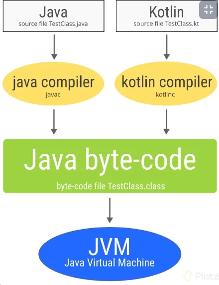

### Qué es la Java Virtual Machine

Una virtual machine es una virtualización o simulación de un sistema operativo o de los procesos que ocurren dentro de este. En nuestro caso, la Java Virtual Machine pertenece al segundo tipo y se encarga de simular los procesos que ocurren dentro de un sistema operativo. A este tipo de máquinas virtuales se les llama Process Virtual Machines.

### ¿Qué ventaja nos da?

Nos ayuda a manejar los punteros y las referencias de memoria que en otros tipos de lenguaje como C o C++ hay que manejar manualmente. Para esto se utiliza un proceso llamado garbage collection. Este proceso se encarga de revisar qué referencia de memoria no se está utilizando para eliminarla y así reducir la cantidad memoria que puede consumir un programa.

### ¿Cómo funciona la JVM?

La JVM funciona como un punto medio entre el código que nosotros escribimos y lo que entiende el sistema operativo del ordenador. Dependiendo del sistema operativo que uses puede variar. La JVM nos ayuda a que nuestro código se ejecute en Linux, Windows y MacOS. Nuestro código es convertido por la JVM a un lenguaje que puede entender el sistema operativo llamado Java Bytecode.

En palabras más simples, nosotros ingresamos código de Kotlin y se transforma en Bytecode. Este proceso puede ocurrir con otros lenguajes como Java, esto hace que nuestro código de Kotlin pueda ser utilizado desde Java y el código de Java pueda ser utilizado en Kotlin.





### Carpetas y ficheros a la izquierda

SI inician con un ** punto “.” **, guardan información de nuestro proyecto.

* “gradle” es un sistema de compilacion de Android
* "build" carpeta que almacena el codigo compilado por gradle
* "src" carpeta más importante donde se encuentra nuestro codigo
* _‘main.kt’ _ fichero que sirve como punto de entrada para el desarrollo de nuestra app
* "test" carpeta de tests necesarios para la app
* _‘build.gradle.kts’ _ fichero que contiene la configuración de como funciona el proyecto, versiones, dependencias, etc.
* _‘gradle.properties’ _ fichero que permite declarar propiedades del proyecto
* ’seetings.gradle.kts’ fichero para especificar propiedades del proyecto


### Variables en Kotlin

var = valores que pueden cambiar
val = valores que no pueden cambiar
const val = valores que no deben camiar nunca, se declaran fuera de las funciones

Declarar variables

{var/val/const val} {nombreVariable} : {Tipo de dato (opcional)} = {valor}


```java
const val PI = 3.1415 //constante

fun main(args: Array<String>) {
    println("Hello World!")
    var optionA = 80 //variable mutable
    println( "numero: "+optionA)
    optionA = 50
    println( "numero cambiado: "+  optionA )

    val name = "susana" //variable inmutable
    println("name: "+ name )
    println("pi"+PI)

```

### Modificadores y tipos de datos en Kotlin

¿Qué es un dato primitivo
Tipos de datos originales de un lenguaje de programación. En Kotlin lo son los enteros, booleanos y cadenas de texto

¿Qué es un objeto
Es una combinación de variables, funciones y otros objetos.
En Kotlin todo es un objeto, se convierten los datos primitivos a un objeto para obtener algunas ventajas como:

Crear funciones especificas para el objeto que ayuden a no reescribir el código

Sobrescribir operadores como la suma o multiplicación

-Enteros
-Cadenas de texto
-Booleanos

Comparten en común que son primitivos ya que vienen directamente con el lenguaje, con ellos se pueden crear objetos.

### Operaciones con los tipos de datos en Kotlin

En Kotlin las operaciones son traducidas a funciones interiormente por el compilador. La operación val tercerValor = primerValor + segundoValor es lo mismo que decir tercerValor = primerValor.plus(segundoValor).

En la siguiente tabla te voy a dejar las operaciones que vas a poder realizar con los distintos tipos de datos y si te encuentras con alguno que no permita realizar esa operación puedes crearla por tu cuenta. Recuerda que Kotlin te permite extender el lenguaje para aprovechar estas funcionalidades.

Operaciones más utilizadas

|Expresión |	Función 	|Operator Fun|
|----------|------------|--------------|
|a + b 	| c = a + b |	public operator fun plus(other: Int): Int|
|a - b 	|c = a - b 	|public operator fun minus(other: Int): Int|
|a * b 	|c = a * b 	|public operator fun times(other: Int): Int|
|a / b 	|a = a / b 	|public operator fun div(other: Int): Int|
|a % b 	|c = a % b 	|public operator fun rem(other: Int): Int|
|a++ 	  |c = a++ 	  |public operator fun inc(): Int|
|a– 	  |c = a– 	  |public operator fun dec(): Int|
|a > b 	|c = a > b 	|public override operator fun compareTo(other: Int): Int|
|a < b 	|c = a < b 	|public override operator fun compareTo(other: Int): Int|
|a >= b  |c = a >= b |public override operator fun compareTo(other: Int)|: Int|
|a <= b |c = a <= b |public override operator fun compareTo(other: Int)|: Int|
|a != b |c = a != b 	|public open operator fun equals(other: Any?): |Boolean|

Dependiendo del tipo de dato que tengas podrás utilizar todos o solamente algunas de estas operaciones, por ejemplo si tienes una variable del tipo de dato String no vas a poder dividirla, a menos que tú crees esa función. Sin embargo, sí vas a poder sumar dos variables del tipo de dato String para obtener el valor de dicha suma.

Con esto espero que hayas obtenido una idea sobre cómo funcionan las operaciones, queda de parte de ti si prefieres utilizar la versión larga del operator fun o el operador directamente.

Ten en cuenta que si las operator fun se inventaron para que puedas reducir tu código a operaciones con símbolos ¿por algo será, no?


### Paradigmas de la programación:

Son formas de escribir código.

* Paradigma Imperativo: Se basa en modificar variables de estado que se encuentran dentro del programa y así hacer que el código realice las tareas que quieres.

* Paradigma declarativo: programacion funcional Nos ayuda a entender que es lo que tiene que hacer un programa, como hace las cosas el programa.


### CONDICIONAL IF

Es un mecanismo que nos proporciona el lenguaje para evaluar condiciones que son true o false y así decidir que bloque de codigo se va a ejecutar.  

Para evaluar las condiciones con la sentencia if debemos aprender el concepto de operador condicional, este operador nos van a servir para evaluar condiciones, los operadores condicional son:  

```
> mayor que.
< menor que.
>= mayor o igual que.
<= menor o igual que
== igualdad.
!= desigualdad.  

```
OPERADORES LOGICOS

Con los operadores logicos podremos comparar mas de una condición.  

&& operador "y": con este operador todas las condiciones tienen que ser verdaderas para que se cumpla la sentencia if.  

|| operador "o": basta que se cumpla una de las condiciones para que se cumpla la sentencia if.  

! operador "no"

### ESTRUCTURA DE CONTROL WHEN

Esta sentencia sirve en los casos que tengamos que comparar nuestra variable con múltiples opciones, ya que con la sentencia IF puede resultar poco optimo. 

SINTAXIS WHEN

* Iniciamos con la palabra reservada WHEN.
* Entre parentesis () escribimos la variable o constante que queremos evaluar.
* Posteriormente, vamos abrir y cerrar llaves {}, dentro de estas escribiremos las diferentes condiciones o casos.
* Cada vez que creamos un condición deberemos escribir un guion y un mayor que (->), luego entre llaves {} colocaremos el bloque de codigo que se va a ejecutar, para ello se escribe println(“el mensaje que va a salir por consola”).
* Por ultimo, utilizaremos ELSE para definir un bloque de codigo en caso que ninguna de nuestras opciones coincidan con el valor de nuestra variable.

EJEMPLO CON STRING

<EJEMPLO:

```java
val pais = "Argentina"

when(pais) {
    "Argentina" -> {
        println("El idioma de ${pais} es Español");
    } "Alemania" -> {
        println("El idioma de ${pais} es Aleman");
    } "EEUU" -> {
        println("El idioma de ${pais} es Ingles");
    } "Brasil" -> {
        println("El idioma de ${pais} es Portugues");
    } else -> {
        println("No conocemos el idioma");
    }
} > 
```

Si tenemos varios casos que coinciden con el mismo valor, lo podremos unir en una única condición colocando una coma(,) al final de cada condición.   

Al trabajar con when y números enteros (Int) podremos usar rangos, para ello debemos:  

* Se utiliza la misma sintaxis.
* En los casos o condiciones utilizaremos la palabra reservada IN.
* Seguido del valor inicial.
* Luego escribir dos puntos (…) y
* Por ultimo, colocamos el valor en donde se quiere que termine nuestro rango.

EJEMPLO CON NUMEROS ENTEROS

```java
val edad = 33;

when(edad) {
    in 0..3 -> {
        println("Tu edad es ${edad} eres un bebe");
    } in 4..11 -> {
        println("Tu edad es ${edad} eres un niño");
    } in 12..18 -> {
        println("Tu edad es ${edad} eres un adolecente");
    } in 19..59 -> {
        println("Tu edad es ${edad} eres un adulto");
    } in 60..99 -> {
        println("Tu edad es ${edad} eres un adulto mayor");
    } else -> {
        println("😲");
    }
}> 
```

### Bucles: While y Do While

Con while podemos hacer que se ejecute un bloque de código determinado hasta que se cumpla una condición.

Cuando usamos este tipo de bucles hay que tener cuidado para evitar producir bucles infinitos no deseados, para lo que necesitamos que dentro del bucle se actualice el valor que usemos en la condición de salida bajo alguna circunstancia.

En el siguiente ejemplo se ejecuta el bucle mientras (while) el día sea menor que 6 y cuando deja de cumplirse termina.

```java
var dia= 1
println("Empiza la semana")
while(dia < 6) {
    if  (dia == 1) {
        println("$dia dia trabajando")
    } else {
        println("$dia dias trabajando")
    }

    dia++ // Actualizamos la condicion
}
println("A descansar")

/* Resultado:
Empiza la semana
1 dia trabajando
2 dias trabajando
3 dias trabajando
4 dias trabajando
5 dias trabajando
A descansar
*/
```

### Null-Safety en Kotlin


Por defecto, todas las variables en Kotlin son non-nullable. De este modo, si intentamos asignar un valor null a cualquier variable, el compilador lanzará un error:

```java
var saludoNullable: String? = "Hola"
saludoNullable = null // Compila
```
Si queremos permitir que una variable pueda ser null, tendremos que definirla añadiendo ? a su tipo de datos.

## nullables

cuando declaras las variables de manera normal, estas no pueden ser inicializadas como null pero s agregamos un **? despues del tipo de dato nos permitira agregar un null**

este tipo de datos es para evitar el null pointer exeption 

si necesitamos obtener la longitud de nuestra variable con ? nos marcara un error pero podemos evitarlo usando un unsafe !!

```java
var myVar : String? = null
//unsafe operator
println(myVar!!.length)
```

## Null-Safety

Una variable es nula, cuando no se le ha asignado un valor 

Sir Tony Hoare, creo la referencia null o null pointer en 1965

Se recomienda evitar usar null, pues este nos puede causar errores al correr la app

### Nulable

Un tipo de dato nullable es una variable que puede contener un null, la forma en que se declaran es la siguiente:

```java
var segundoNombre? = "Maribel"
```

### Safe calls

es una herramienta que nos proporciona Kotlin, que nos hayuda a ejecutar cierto codigo cuando la variable no es nula, y lo realizamo de la sigueinte manera:

```java
println(segundoNombre?.length())
```

### Double bang !!

el operador !! le dice al compilador que estas 100% seguro de que en ese punto la variable no es null.

Se recomienda usarlo poco, por que puede ser considerado mala practica y ademas puede que la variable si llegue null 

### Elvis operation

Elvis operation ?: nos regresa un valor por defecto cuando una variable  es null y de esa forma evitamos ciertos errores

```java
fun main() {
    //cone el signo ? indicamos que la variable puede ser null
    var nombre : String? =  null;

    val caracterNumber :Int = nombre?.length ?: 0
    println(caracterNumber)

}
```

Ojo!

* Tu no puedes tener un catch o finally sin un try
* Tu no puedes poner codigo entre el try y el catch, o el catch y el finally.

por ejemplo:

```java
try { callRiskyCode( ) }
x = 7
catch(e: Bad Exception) {}
```

* Un try puede estar seguido de un catch o un finally
* Un try puede tener multiples catch blocks.

Esta explicacion esta en el libro Head First Kotlin en la pagina 244. Un gran libro en ingles que recomiendo mucho!


### 0El Elvis operator ?: 

Es una versión segura de una expresión if. Devuelve el valor a su izquierda si no es nulo. De lo contrario, devuelve el valor a su derecha… por ejemplo:

```java
w?.play ?: -1

```

El Elvis operator primero verifica el valor a su izquierda, en este caso w?.play y si ese valor no es null, el Elvis operator lo retorna. En el caso de que el valor de la izquierda sea null, el Elvis operator retornara el valor de la derecha, en este caso -1

es como decir "si w no es nulo y su propiedad de play no es nula, devuelve el valor de la propiedad de play, de lo contrario, devuelve -1

Pueden encontrar mas información sobre este tema en el libro que les recomende anteriormente Head First Kotlin!

### Listas


* Las listas son inmutables, si queremos agregar, remover o usar funciones mas avanzadas necesitaremos una mutableList.
* Podemos tener valores duplicados en una lista
* Podemos recorrer todos los elementos de una lista
* La principal diferencia entre una lista y un array es que la lista no puede actualizar ninguna de las referencias que almacena


```java
fun main(args: Array<String>) {

    // Lista inmutable
    val listaDeNombre = listOf("Nestor", "Joel", "Camila")
    println(listaDeNombre)

    // Lista mutable
    val listaVacia = mutableListOf<String>()
    println(listaVacia)
    listaVacia.add("Nestor") //.add agregar un valor a la lista
    println(listaVacia)

    val valorUsandoGet = listaVacia.get(0) //.get Obtener el valor de la lista
    println(valorUsandoGet)

    val valorUsandoOperador = listaVacia[0]
    println(valorUsandoOperador)


    val primerValor: String? = listaDeNombre.firstOrNull() // .first Obtener el  primer valor de una lista
    println(primerValor)

    listaVacia.removeAt(0) // removeAt Eliminar elementos de la una lista
    println(listaVacia)

    listaVacia.add("Joel")
    listaVacia.removeIf() {caracteres -> caracteres.length > 3} // removeIf Solo cuando la condicion sea valida
    println(listaVacia)

    val myArray = arrayOf(1,2,3,4,5)
    println("Mi array $myArray")
    println("Array como lista ${myArray.toList()}")
    
    // Para performance utilizar siempre arrays ** de lo contraria utilizar listas
}

```

### Filtrar listas

```java
fun main(args: Array<String>) {
    val numerosDeLoteria = listOf(11, 15, 30, 66, 5)

    //Ordenar ascendentemente con sorted
    val numerosSorted = numerosDeLoteria.sorted()
    println(numerosSorted)

    //Ordenar descendentemente con sortedDescending
    val numerosDescendientes = numerosDeLoteria.sortedDescending()
    println(numerosDescendientes)

    //Ordenar dependiendo de una condición con sortedBy
    val ordenarPorMultipos = numerosDeLoteria.sortedBy { num -> num < 50 }
    println(ordenarPorMultipos)

    //Ordenar de forma aleatoria
    val numerosAletorios = numerosDeLoteria.shuffled()
    println(numerosAletorios)

    //Ordenar de forma inversa
    val numerosEnReversa = numerosDeLoteria.reversed()
    println(numerosEnReversa)


    //Funciones de programación funcional

    //Map - Convertir un elemento de un tipo a otro tipo // siempre devuelve el ultimo valor

    val mensajesDeNumeros = numerosDeLoteria.map { num -> "Tu numero de lotería es $num" }
    println(mensajesDeNumeros)

    //Filtrar elementos dependiendo de condiciones con filter
    val numerosFiltrados = numerosDeLoteria.filter { num -> num > 50 }
    println(numerosFiltrados)
}

```

### Maps

Los mapas asocian claves con valores. Las claves deben ser únicas, pero los valores asociados no. De este modo, cada valor puede ser usado para identificar de manera única el valor asociado, ya que el mapa asegura que no puedes duplicar claves en la colección. Internamente, Kotlin usa la colección Java Map para implementar los mapas.
A diferencia de las interfaces List y Set en Kotlin que extienden la interfaz Collection, la interfaz Map no extiende nada. Algunas de las propiedades y funciones disponibles en esta interfaz se muestran a [g1] continuación. Observa como solo se permite hacer consultas, al definir una colección inmutable.
```java
//size: tamaño de la colección.

isEmpty(): //indica si el mapa está vacío.
containsKey(key: K): //indica si el mapa contiene una clave.
containsValue(value: V): // indica si el mapa contiene un valor.
get(key: K): //valor asociado a la llave dada o null si no se encuentra.
keys: //devuelve un Set inmutable con todas las claves en el mapa.
values: Collection //inmutable de todos los valores en el mapa.
mapOf() //crea un mapa inmutable compuesto por una lista de pares, donde el primer valor es la clave, y el segundo es el valor. Devuelve un objeto de tipo Map.

val prefijos: Map<Int, String> = mapOf(34 to "España", 1 to "USA", 233 to "Ghana")
for ((key, value) in prefijos) {
    println("$key es el código telefónico de $value")
}

//Podemos obtener el valor de una clave usando la función get(). También podemos usar los corchetes como un atajo para get().

print(prefijos.get(34)) // España
print(prefijos[34])     // España 

//La interfaz MutableMap no extiende la interfaz MutableCollection; su único padre es la interfaz Map. Este anula las propiedades keys, entries y values de la interfaz padre para poder redefinirlas. Además, incluye algunas funciones extra como:

put(key: K, value: V) //inserta el par clave-valor en el mapa. Devolverá el valor previo enlazado con la clave o null si la clave no existía.
remove(key: K) //borra la clave y su valor enlazado.
putAll(from: Map<out K, V>) //agrega nuevos pares clave-valor desde otro mapa. Si una clave ya existente será actualizada con el nuevo valor.
clear() //elimina todos los elementos del mapa.
mutableMapOf() //permite crear un mapa mutable sin indicar la implementación:

val monedas: MutableMap<String, String> = mutableMapOf("euro" to "España", "dolar" to "EEUU", "libra" to "UK")

println("Paises ${ monedas.values}") 
println("Monedas ${ monedas.keys}") 
monedas.put("cedi", "Ghana")
monedas.remove("dolar")  

```
Para indicar implementaciones específicas dispones de: hashMapOf() para crear un mapa de tipo LinkedHashMap., donde puedes consultar el orden en que los elementos fueron insertados, y sortedMapOf() para SortedMap, en el cual todas las entradas se almacenan en un orden de clave ascendente.


### Sets

Set Es similar a una lista, pero sin elementos repetidos

```java
fun main(args: Array<String>) {

    //Conjunto inmutable
    val vocalesRepidas = setOf("a", "e", "i", "o", "u", "a", "e", "i", "o", "u")
    println(vocalesRepidas)

    //Conjunto mutable
    val numerosFavoritos = mutableSetOf(1, 2, 3, 4)
    println(numerosFavoritos)
    numerosFavoritos.add(5)
    numerosFavoritos.add(5)
    println(numerosFavoritos)
    // Se elimina el elemento dependiendo del valor
    numerosFavoritos.remove(1)
    println(numerosFavoritos)

    val valorDelSet = numerosFavoritos.firstOrNull{ num -> num > 2}
    println(valorDelSet)
}
```

### ¿Qué son las funciones?

Las funciones se declaran usando la palabra clave fun, seguida del nombre del método, los paréntesis donde declararemos los valores de entrada y unas llaves que limitan la función.

```java
fun main(args: Array<String>) {
    showMyName()
    showMyLastName()
    showMyAge()
}
fun showMyName(){
    println("Me llamo Aris")
}
fun showMyLastName(){
    println("Mi Apellido es Guimerá")
}
fun showMyAge(){
    println("Tengo 24 años")
}
```
Si os fijáis en el código anterior, tenemos 4 métodos. 3 de ellos están destinados para una sola función (mostrar nombre, edad y apellidos) pero no se ejecutarán a no ser que sean llamados. Por ello el cuarto método que es el que se ejecutar el código, los llamará en el orden que le pongamos. Dándonos un resultado así.

Funciones con parámetros de entrada
Ahora vamos a ver las funciones con parámetros de entrada, que son iguales, pero al llamarlas habrá que mandarle las variables que necesite.

```java
fun main(args: Array<String>) {
    showMyInformation("Aris", "Guimerá", 24)
}
fun showMyInformation(name: String, lastName: String, age: Int){
    println("Me llamo $name $lastName y tengo $age años.")
}
```
Como se puede observar, tiene tres parámetros de entrada, la forma de declararlos es muy fácil el nombre de la variable, seguida de dos puntos y el tipo de variable, aquí si es obligatorio definir el tipo.

Obviamente al llamar al método podemos pasarle variables recuperadas de otros métodos y demás.

Funciones con parámetros de salida
Nos queda por ver como una función puede devolver un resultado o lo que haga nuestro método. La única limitación es que solo se puede devolver un parámetro, aunque para eso tenemos los métodos (ya lo veremos más tarde).

```java
fun main(args: Array<String>) {
    var result = add(5, 10)
    println(result)
}
fun add(firsNumber: Int, secondNumber: Int) : Int{
    return firsNumber + secondNumber
}

```

Como el ejemplo anterior añadimos los parámetros de entrada pero esta vez, al cerrar los paréntesis pondremos el tipo de variable que debe devolver nuestra función. Luego la función hará todo lo que tenga que hacer y cuando tenga el resultado, lo devolveremos con la palabra clave return.

Si el método es muy fácil, podemos evitar las llaves y simplificar la función un poco más.

```java
fun add(firsNumber: Int, secondNumber: Int) : Int = firsNumber + secondNumber
```

### Funciones de extensión en Kotlin

Las funciones de extensión (o extension functions en inglés) son funciones que, como su propio nombre indica, nos ayudan a extender la funcionalidad de clases sin necesidad de tocar su código. Ahora vamos a ver cómo se definen estas funciones, y algunos ejemplos que a mí personalmente me resultan muy útiles.

¿Cómo se define una función de extensión?
Tan solo hay que escribir una función como lo harías normalmente, y ponerle delante el nombre de la clase separado por un punto.

Ejemplo muy sencillo: queremos hacer que una vista tenga la función visible(), que la hace visible. Escribiríamos algo como esto:

```java
fun View.visible() {
    this.visibility = View.VISIBLE
}
//El this  lo he puesto para que veas que podemos usar las funciones y propiedades de esa clase como si estuviéramos dentro de  la propia clase, pero lo puedes omitir:

fun View.visible() {
    visibility = View.VISIBLE
}

```
Algunos ejemplos interesantes
Hay un par de ejemplos que me gusta poner, porque resumen muy bien la potencialidad de esto.

El primero es cuando estás inflando una vista dentro de un adapter. Normalmente utilizarías algo así:

```java
override fun onCreateViewHolder(parent: ViewGroup, viewType: Int): ViewHolder {
    val v = LayoutInflater.from(parent.context).inflate(R.layout.view_item, parent, false)
    return ViewHolder(v)
}
```
La línea que infla la vista y usa el parent es demasiado compleja, y el 99% de las veces suele ser igual en cualquier adapter. ¿Por qué no hacer que los ViewGroup  puedan inflar vistas?

```java
fun ViewGroup.inflate(layoutRes: Int): View {
    return LayoutInflater.from(context).inflate(layoutRes, this, false)
}

//Ahora ya puedes utilizarlo en el código de arriba:

override fun onCreateViewHolder(parent: ViewGroup, viewType: Int): ViewHolder {
    val v = parent.inflate(R.layout.view_item)
    return ViewHolder(v)
}
```
Un ejemplo muy parecido se puede hacer con las imágenes. Si utilizas por ejemplo la librería de Picasso, necesitas andar haciendo el típico ritual:

Picasso.with(imageView.context).load(url).into(imageView)

¿Qué te parecería poder decirle a ImageView que cargue una url directamente?

```java
fun ImageView.loadUrl(url: String) {
    Picasso.with(context).load(url).into(this)
}

imageView.loadUrl(url)
```

Propiedades de extensión

Igual que puedes hacer funciones de extensión, lo mismo puedes hacer con properties. Lo único que no podrán guardar un estado propio, sino valerse de las funciones ya existentes para modificar el estado:

```java
val ViewGroup.children: List get() = (0..childCount -1).map { getChildAt(it) }
//  Esta property recupera los hijos de un ViewGroup
// Ahora podrías iterar sobre ellos directamente:
parent.children.forEach { it.visible() }
```

Nota: it es una palabra reservada que se utiliza para acceder al valor de entrada de la función, cuando solo hay uno. Como ya hemos visto en otros artículos, se pueden nombrar esos valores de entrada, y asignar más cuando hay más de uno.

Conclusión
Con las funciones y las propiedades de extensión puedes extender cualquier librería a la que no tengas acceso y luego utilizar esas funciones y propiedades como si fueran propias de la clase. Lo único que verás es un import extra en el archivo en el que se use.

Si de verdad vas en serio con Kotlin y, como yo, piensas que es el lenguaje del futuro en Android, te recomiendo que le eches un vistazo al training gratuito, donde te contaré todo lo que necesitas para aprender a crear tus Apps Android en Kotlin desde cero.

### Parámetros por defecto

Una de las características de Kotlin es la posibilidad de trabajar con funciones con parámetros con valores por defecto. Tomemos como ejemplo la función sum que tiene dos parámetros y le agregamos un parámetro más:
```java
fun sum(x:Int, y:Int, z:Int): Int{
   return x + y + z
}

//Se podría asignar un valor a una de las variables:

fun sum(x:Int, y:Int, z:Int = 0): Int{
   return x + y + z
}

//Luego la función sum, podría llamarse de las siguientes maneras:

sum(3, 2, 1)
sum(2, 4)

```
En ambos casos funciona en forma adecuada. Esto tiene una ventaja pues permite crear funciones con parámetros por defecto, con lo cual evita realizar sobre carga de funciones. En lenguajes como Java no hay parámetros por defecto, con lo cual muchas veces se tiene que sobre cargar los métodos.

Parámetros con nombres
Que sucede si queremos imprimir determinados parámetros que no sean contiguos, por ejemplo, el primero y el tercero.

```java
//Generamos una nueva función:

fun printDetails(name:String,email:String = "", phone:String){
 println("name: $name - email: $email - phone: $phone")
}

//Si hacemos email con un valor por defecto:

printDetails("Juan", "123 123")
```
Esta función nos genera erro, pues el tercer valor phone, no tiene asignado un valor por defecto y es requerido. Por otro lado, por la forma de la variable, el valor indicado corresponde a phone, más el método no sabe como distinguir que es el tercer parámetro. Esto se soluciona utilizando el valor de los parámetros:

```java
printDetails("Juan", phone="123 123")

//Al tener el nombre de los parámetros, se pueden ingresar los parámetros en un orden indistinto:

printDetails(name="Juan", phone = "123 123")
printDetails(phone = "123 123", name="Juan" )

```
Esto es util cuando tengo funciones con múltiples parámetros. Usar el nombre de los parámetros permite ser más expresivo con nuestro código.

No es recomendable tener funciones con cinto o seis parámetros, para esto es recomendable tener un objeto que agrupe este conjunto de parámetros, pero en caso de que tengamos este tipo de funciones. El uso de los nombres es muy útil.


### Lambdas

Las funciones lambda (“lambdas”) son una forma sencilla de crear funciones ad-hoc (para un fin determinado). Las lambdas se pueden denotar de forma muy concisa en muchos casos gracias a la inferencia de tipos y la variable it implícita.


Ejemplos de declaración de Lambdas:

```java
//Una lambda con tipos explícitos en todas partes. La lambda es la parte entre llaves, que se asigna a una variable de tipo (String) -> String (un tipo de función)
val upperCase1: (String) ->String={str: String -> str.uppercase()}

//Inferencia de tipo dentro de lambda: el tipo del parámetro lambda se infiere del tipo de variable a la que está asignado.
val upperCase2: (String) -> String = {str -> str.uppercase()}

//Inferencia de tipo fuera de lambda: el tipo de variable se infiere del tipo del parámetro lambda y el valor de retorno.
val upperCase3 = {str: String -> str.uppercase()}

//No puede hacer ambas cosas a la vez, el compilador no tiene la posibilidad de inferir el tipo de esa manera.
//val upperCase4: {str -> str.uppercase()}


//Para lambdas con un solo parámetro, no tiene que nombrarlo explícitamente. En su lugar, puede utilizar la variable it implícita. Esto es especialmente útil cuando se puede inferir el tipo (que suele ser el caso).
val upperCase5: (String) -> String = {it.uppercase()}

//Si su lambda consta de una única llamada de función, puede usar punteros de función (: :).
val upperCase6: (String) -> String = String::uppercase
println(upperCase1("hello"))
println(upperCase2("hello"))
println(upperCase3("hello"))
println(upperCase5("hello"))
println(upperCase6("hello"))

```

### High Order functions

Funciones de orden superior

Kotlin es un lenguaje orientado a objetos pero introduce características existentes en los lenguajes funcionales que nos permiten crear un código más claro y expresivo.

Una de las características del paradigma de la programación funcional son las funciones de orden superior.

Las funciones de orden superior son funciones que pueden recibir como parámetros otras funciones y/o devolverlas como resultados.

Veremos una serie de ejemplos muy sencillos para ver como Kotlin implementa el concepto de funciones de orden superior y a medida que avancemos en el curso podremos ver las ventajas de este paradigma.

Problema 1
Definir una función de orden superior llamada operar. Llegan como parámetro dos enteros y una función. En el bloque de la función llamar a la función que llega como parámetro y enviar los dos primeros parámetros.
La función retorna un entero.

Proyecto147 - Principal.kt
```java
fun operar(v1: Int, v2: Int, fn: (Int, Int) -> Int) : Int {
    return fn(v1, v2)
}

fun sumar(x1: Int, x2: Int) = x1 + x2

fun restar(x1: Int, x2: Int) = x1 - x2

fun multiplicar(x1: Int, x2: Int) = x1 * x2

fun dividir(x1: Int, x2: Int) = x1 / x2

fun main(parametro: Array<String>) {
    val resu1 = operar(10, 5, ::sumar)
    println("La suma de 10 y 5 es $resu1")
    val resu2 = operar(5, 2, ::sumar)
    println("La suma de 5 y 2 es $resu2")
    println("La resta de 100 y 40 es ${operar(100, 40, ::restar)}")
    println("El producto entre 5 y 20 es ${operar(5, 20, ::multiplicar)}")
    println("La división entre 10 y 5 es ${operar(10, 5, ::dividir)}")
}

//Tenemos definidas 6 funciones en este problema. La única función de orden superior es la llamada “operar”:

fun operar(v1: Int, v2: Int, fn: (Int, Int) -> Int) : Int {
    return fn(v1, v2)
}

//El tercer parámetro de esta función se llama “fn” y es de tipo función. Cuando un parámetro es de tipo función debemos indicar los parámetros que tiene dicha función (en este caso tiene dos parámetros enteros) y luego del operador -> el tipo de dato que retorna esta función:

fn: (Int, Int) -> Int

//Cuando tengamos una función como parámetro que no retorne dato se indica el tipo Unit, por ejemplo:

fn: (Int, Int) -> Unit

//El algoritmo de la función operar consiste en llamar a la función fn y pasar los dos enteros que espera dicha función:

return fn(v1, v2)

//Como la función operar retorna un entero debemos indicar con la palabra clave return que devuelva el dato que retorna la función “fn”.

//Las cuatro funciones que calculan la suma, resta, multiplicación y división no tienen nada nuevo a lo visto en conceptos anteriores:

fun sumar(x1: Int, x2: Int) = x1 + x2

fun restar(x1: Int, x2: Int) = x1 - x2

fun multiplicar(x1: Int, x2: Int) = x1 * x2

fun dividir(x1: Int, x2: Int) = x1 / x2

//En la función main llamamos a la función operar y le pasamos tres datos, dos enteros y uno con la referencia de una función:

val resu1 = operar(10, 5, ::sumar)

//Como vemos para pasar la referencia de una función antecedemos el operador ::
//La función operar retorna un entero y lo almacenamos en la variable resu1 que mostramos luego por pantalla:

println("La suma de 10 y 5 es $resu1")

// Es importante imaginar el funcionamiento de la función operar que recibe tres datos y utiliza uno de ellos para llamar a otra función que retorna un valor y que luego este valor lo retorna operar y llega finalmente a la variable “resu1”.

// Llamamos a operar y le pasamos nuevamente la referencia a la función sumar:

val resu2 = operar(5, 2, ::sumar)
println("La suma de 5 y 2 es $resu2")

// De forma similar llamamos a operar y le pasamos las referencias a las otras funciones:

println("La resta de 100 y 40 es ${operar(100, 40, ::restar)}")
println("El producto entre 5 y 20 es ${operar(5, 20, ::multiplicar)}")
println("La división entre 10 y 5 es ${operar(10, 5, ::dividir)}")

```
Tener en cuenta que para sumar dos enteros es mejor llamar directamente a la función sumar y pasar los dos enteros, pero el objetivo de este problema es conocer la sintaxis de las funciones de orden superior presentando el problema más sencillo.

Las funciones de orden superior se pueden utilizar perfectamente en los métodos de una clase.

Problema 2

Declarar una clase que almacene el nombre y la edad de una persona. Definir un método que retorne true o false según si la persona es mayor de edad o no. Esta función debe recibir como parámetro una función que al llamarla pasando la edad de la persona retornara si es mayor o no de edad.
Tener en cuenta que una persona es mayor de edad en Estados Unidos si tiene 21 o más años y en Argentina si tiene 18 o más años.

Proyecto148 - Principal.kt

```java
class Persona(val nombre: String, val edad: Int) {
    fun esMayor(fn:(Int) -> Boolean): Boolean {
        return fn(edad)
    }
}

fun mayorEstadosUnidos(edad: Int): Boolean {
    if (edad >= 21)
        return true
    else
        return false
}

fun mayorArgentina(edad: Int): Boolean {
    if (edad >= 18)
        return true
    else
        return false
}

fun main(parametro: Array<String>) {
    val persona1 = Persona("juan", 18)
    if (persona1.esMayor(::mayorArgentina))
        println("${persona1.nombre} es mayor si vive en Argentina")
    else
        println("${persona1.nombre} no es mayor si vive en Argentina")
    if (persona1.esMayor(::mayorEstadosUnidos))
        println("${persona1.nombre} es mayor si vive en Estados Unidos")
    else
        println("${persona1.nombre} no es mayor si vive en Estados Unidos")
}

// Declaramos la clase Persona con dos propiedades llamadas nombre y edad:

class Persona(val nombre: String, val edad: Int) {

// La clase persona por si misma no guarda la nacionalidad de la persona, en cambio cuando se pregunta si es mayor de edad se le pasa como referencia una función que al pasar la edad nos retorna true o false:

fun esMayor(fn:(Int) -> Boolean): Boolean {return fn(edad)}

// Tenemos dos funciones que al pasar una edad nos retornan si es mayor de edad o no:

fun mayorEstadosUnidos(edad: Int): Boolean {
    if (edad >= 21)
        return true
    else
        return false
}

fun mayorArgentina(edad: Int): Boolean {
    if (edad >= 18)
        return true
    else
        return false
}

// En la función main creamos un objeto de la clase persona:

val persona1 = Persona("juan", 18)

// Llamamos al método esMayor del objeto persona1 y le pasamos la referencia de la función “mayorArgentina”:

 if (persona1.esMayor(::mayorArgentina))
        println("${persona1.nombre} es mayor si vive en Argentina")
    else
        println("${persona1.nombre} no es mayor si vive en Argentina")

// Ahora llamamos al método esMayor pero pasando la referencia de la función “mayorEstadosUnidos”:

if (persona1.esMayor(::mayorEstadosUnidos))
        println("${persona1.nombre} es mayor si vive en Estados Unidos")
    else
        println("${persona1.nombre} no es mayor si vive en Estados Unidos")

// Como podemos comprobar el concepto de funciones de orden superior es aplicable a los métodos de una clase.

// No hicimos un código más conciso con el objeto que quede más claro la sintaxis de funciones de orden superior, pero el mismo problema puede ser:

class Persona(val nombre: String, val edad: Int) {
    fun esMayor(fn:(Int) -> Boolean) = fn(edad)
}


fun mayorEstadosUnidos(edad: Int) = if (edad >= 21) true else false

fun mayorArgentina(edad: Int) = if (edad >= 18) true else false

fun main(parametro: Array<String>) {
    val persona1 = Persona("juan", 18)
    if (persona1.esMayor(::mayorArgentina))
        println("${persona1.nombre} es mayor si vive en Argentina")
    else
        println("${persona1.nombre} no es mayor si vive en Argentina")
    if (persona1.esMayor(::mayorEstadosUnidos))
        println("${persona1.nombre} es mayor si vive en Estados Unidos")
    else
        println("${persona1.nombre} no es mayor si vive en Estados Unidos")
}
```

### La Función let { }

La función let es una función que crea un alcance temporal para un objeto en el interior de un bloque de código.

Esto quiere decir, que puedes referirte al objeto sin usar su nombre debido a que es el parámetro de la función lambda pasada a let.

inline fun <T, R> T.let(block: (T) -> R): R

Lenguaje del código: HTML, XML (xml)
Como vez en su declaración, let:

* Es una función genérica con argumentos T y R
* Es una función inline
* Es una función de extensión del tipo recibidor T
* Recibe como parámetro un tipo función (T) -> ®
* Retorna como resultado a R
* Ya que let ejecuta a block pasando la expresión this del objeto recibidor, es como si crearas un espacio de escritura para tus sentencias asociadas al objeto.

```java
val resultado = objeto.let{
    /* sentencias y retorno de valor */
}
```

Lenguaje del código: Kotlin (kotlin)

Ejemplo: Función let Para Mapear

```java
// Supongamos que tenemos una clase para las facturas junto a otra que representa las líneas que están en ella:

class InvoiceLine(val unitCost: Double)
class Invoice(val customer: String, val lines: List<InvoiceLine>)

// Lenguaje del código: Kotlin (kotlin)
// Ahora deseamos leer una factura y formatear las propiedades de la misma para mostrarlas en pantalla.

fun main() {
    val invoice = Invoice(
        "Fabricia",
        listOf(
            InvoiceLine(5.0),
            InvoiceLine(4.0),
            InvoiceLine(6.0)
        )
    )

    val invoiceDetail = invoice.let {
        val total = it.lines.sumOf { line -> line.unitCost }
        "La factura de ${it.customer} tiene un total de $total"
    }

    println(invoiceDetail)
}

```
Salida:

La factura de Fabricia tiene un total de 15.0

Como puedes notar, al invocar a invoice.let{}, el parámetro del lambda será invoice, por lo que podemos usar a it como referencia.

Con esta forma podemos obtener el total de la factura a través de it.lines.sumOf{} y construir un String resultante con it.customer.

El objetivo es crear un contexto que te permita mejorar la legibilidad del propósito de tu código.

Ejemplo: Función let Y Tipos Anulables

La función let también es de utilidad para ejecutar sentencias sobre tipos anulables en conjunto con el operador de acceso seguro(.?).

Si el objeto recibidor no es null, entonces las sentencias del lambda que pasaste como bloque de código son ejecutadas, de lo contrario no habrá acción.

Por ejemplo, ¿que pasaría si la factura leída fuese nula e intentaras imprimir su detalle?:

```java
fun main() {
    val invoice: Invoice? = null

    val invoiceDetail = invoice?.let {
        val total = it.lines.sumOf { line -> line.unitCost }
        "La factura de ${it.customer} tiene un total de $total"
    }

    println(invoiceDetail)
}

//Resultado: null
```

Lenguaje del código: JavaScript (javascript)
La función let tratará a invoice como si fuese no aceptara nulos en todo el alcance del lambda, de esta forma te evitas la comprobación de nulidad en cada línea del bloque de código.

Y si es null, entonces el parámetro block de let() no será ejecutado.


### With

“La función with nos ayuda a acceder directamente a las propiedades de la variable o a la misma variable utilizando this”

```java
fun main(args: Array<String>) {
	val colores = listOf("Azul", "Amarillo", "Rojo")

	// Tenemoes accedo directo al scope de colores con with, así ya no necesitamos escribir el nombre de la variable
	with(colores){
		println("Nuestros colores son $this")
		println("Esta lista tiene una cantidad de colores de $size")
	}
}
```

### Run

```java
fun main(args: Array<String>){
    val moviles = mutableListOf("Samsung A50","Samsung A51","Samsung A52")
            .run{
                removeIf{ movil->movil.contains("A50") }
                this
            }
    println(moviles)
}

```

### Apply

La Función apply

El propósito de la función apply es tomar como alcance al objeto recibidor T sobre el que es invocado, aplicar las sentencias del parámetro block que recibe sobre dicho contexto y retornar el mismo objeto modificado.
```java
inline fun <T> T.apply(block: T.() -> Unit): T

```
Lenguaje del código: Kotlin (kotlin)
Como ves, el cuerpo del tipo función a pasar es Unit, esto significa que no es necesario especificar un resultado en la última línea de la lambda con recibidor que pases como argumento.

Para referirte al recibidor, usa la expresión this y así tendrás acceso a los miembros.
```java
instancia.apply{
    // Modificación de propiedades
    // Llamada de métodos
    // etc.
}
```
La función apply trabaja similar a with, solo que apply es una función de extensión y retorna al objeto recibidor como resultado.

Esto te permite inicializar propiedades cuando creas u obtienes instancias de una clase e incluso encadenar operaciones subsecuentes.

Ejemplo Con La Función apply
Tomemos como ejemplo la declaración de una clase que representa un par de zapatos en el inventario de un negocio.
```java
data class Shoe(
    var size: Int = 38,
    var color: String = "Negro",
    var stock: Int = 10
)

// Ahora supongamos que es necesario crear una instancia inicial por defecto, luego es necesario cambiar sus propiedades y finalmente imprimir su detalle.

fun main() {
    val newShoe = Shoe()

    val shoeDetail = newShoe.apply {
        size = 42
        color = "Rojo"
        stock = 25
    }.toString()

    print(shoeDetail)
}

//Salida:

Shoe(size=42, color=Rojo, stock=25)
```
Al usar la función apply sobre la instancia del par de zapatos, fue posible acceder directamente a cada propiedad, ya que el contexto de la función lambda es newShoe. Si usas IntelliJ podrás un mensaje del objeto recibidor permanente:

Función apply En Android
La función apply es de gran utilidad cuando obtienes referencias de views en Android o las creas desde el código.

Por ejemplo, supón que requieres crear un CheckBox dinámicamente en un fragmento que maneja la creación de cuentas para tus usuarios.

Usando apply, puedes setear las propiedades necesarias para construcción:

```java
val checkBox = CheckBox(requireContext()).apply {
    text = "¿Enviar boletín semanal"

    isChecked = true
    contentDescription = "CheckBox para boletín semanal"
    setPadding(20)
}
```
Habrán propiedades cuyo mutador set() sea privado y no puedas acceder con el acceso de punto, por lo que debes usar directamente los métodos de asignación como setPadding().