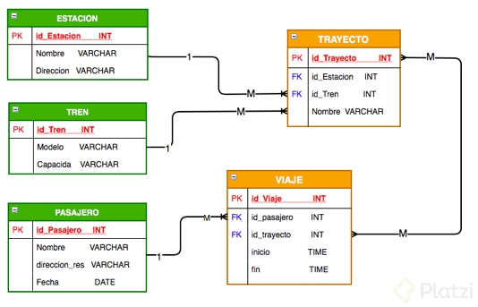
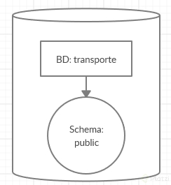
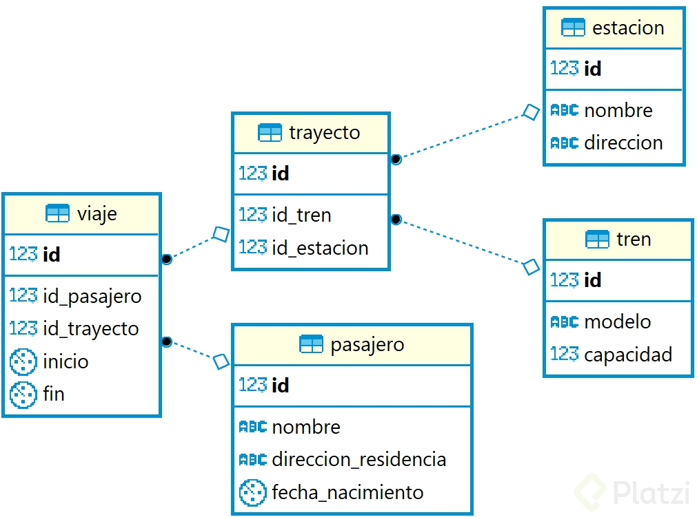

### ¿Qué es Postgresql?

El motor de bases datos (RDBMS) es quién estructura toda la información de la base de dato. 
El servidor es una computadora dónde se instala el motor de base de dato. 
La bases es la información ordenada, relacionada y estructurada a la cual accedemos con SQL

Buenas praticas

• A: Atomicity – Atomicidad -> Separar las funciones desarrolladas en la BD como pequeñas tareas y ejecutarlas como un todo. Si alguna tarea falla se hace un rollback(Se deshacen los cambios)
• C: Consistency – Consistencia -> Todo lo que se desarrolló en base al objeto relacional. Los datos tienen congruencia
• I: Isolation – Aislamiento -> Varias tareas ejecutándose al mismo tiempo dentro de la BD
• D: Durability – Durabilidad -> Puedes tener seguridad que la información no se perderá por un fallo catastrófico. PostgreSQL guarda la información en una Bitácora

### Install PostgreSQL and pgAdmin on Ubuntu 20.04

sudo apt-get update
lsb_release -a
sudo apt install postgresql

- Set root user credentials
sudo -u postgres psql
ALTER USER postgres PASSWORD 'Ejemplo*';
\q

Henceforth you can login to the PostgreSQL shell using the command
psql -U postgres -h localhost

\du


CREATE USER userEjemplo WITH SUPERUSER CREATEROLE CREATEDB LOGIN ENCRYPTED PASSWORD 'Ejemplo*';

--You should also create a database with the same name as the user. Create database using the command

CREATE DATABASE tableEjemplo;

\l

--You can grant access to existing databases to the user using the command

GRANT ALL PRIVILEGES ON DATABASE tableEjemplo TO userEjemplo;


pgAdmin4 

Create the repository configuration file:
curl https://www.pgadmin.org/static/packages_pgadmin_org.pub | sudo apt-key add

-- after
sudo sh -c 'echo "deb https://ftp.postgresql.org/pub/pgadmin/pgadmin4/apt/$(lsb_release -cs) pgadmin4 main" > /etc/apt/sources.list.d/pgadmin4.list && apt update'

--
To install desktop mode, use the command:

sudo apt install pgadmin4-desktop

To install web mode, use the command:

sudo apt install pgadmin4-web

To install both, use the command:

sudo apt install pgadmin4


To configure web mode, run the command:

sudo /usr/pgadmin4/bin/setup-web.sh


Comandos importantes:
Si quiero ver el listado de todos los comandos con \ escribo en consola de postgres: ?

* Ver los comandos de POSTGRES : \?
* Listar todas las bases de datos: \l
* Ver las tablas de una base de datos: \dt
* Cambiar a otra base de datos: \c nombre_DB
* describir una tabla: \d nombre_tabla
* Ver comandos SQL: \h
* Ver como se ejecuta un comando SQL: \h nombre_de_la_función
* Control + c: Cancela todo lo que hay en pantalla.
* Consultar versión de postgres instalada: SELECT version();
* Volver a ejecutar la función que acabaste de ejecutar en la consola: \g
* Inicializar el contador de tiempo para que la consola diga cuanto se demoro en ejecutar ese comando : \timing
* Control + L: Limpiar pantalla.

### Archivos de Configuración

A través de la sentencia SHOW CONFIG se nos muestra donde están los 
archivos de configuración. En mi caso la ruta es:
/Library/PostgreSQL/12/data/postgresql.conf
```sql
SHOW config_file;
```

Algo a tener en cuenta es que en la ruta por default de instalación no se puede acceder debido a falta de permisos. Para ingresar basta con un:

sudo cd /Library/PostgreSQL/12/data/

Postgresql.conf: Configuración general de postgres, múltiples opciones referentes a direcciones de conexión de entrada, memoria, cantidad de hilos de pocesamiento, replica, etc.

pg_hba.conf: Muestra los roles así como los tipos de acceso a la base de datos.

pg_ident.conf: Permite realizar el mapeo de usuarios. Permite definir roles a usuarios del sistema operativo donde se ejecuta postgres.


### Comandos mas usados

```sql
SELECT VERSION();
    PostgreSQL 11.6 (Ubuntu 11.6-1.pgdg18.04+1) on x86_64-pc-linux-gnu, compiled by gcc (Ubuntu 7.4.0-1ubuntu1~18.04.1) 7.4.0, 64-bit
\h -- ayuda
\h comando -- ayuda del comando especifico
\l -- Listar las bases
\c base de datos --moverse a una base de datos especifica
\dt -- listar las tablas de la base actual
\dn -- listar los esquemas de la base actual
\dv -- listar las vistas
\df -- listar las funciones
\du -- listar los usuarios
\g -- ejecutar ultimo comando 
\s -- historial de comandos
\l nombrearchivo --guardar lista de comandos
\i nombre archivo -- ejecuta comandos guardados
\e -- abrir editor 
\ef -- editor de funciones
\timming -- activar o desactivar el tiempo de respusta de las consultas
\q cerra consola
CREATE DATABASE base; -- crea base
CREATE TABLE tabla (columnas); crea tabla
INSERT INTO tabla(columna) VALUES('dato');
SELECT * FROM tabla;
UPDATE tabla SET cammpo = dato WHERE condicion;
DELETE FROM tabla WHERE condicion;

select current_date;
select current_time;

```

### Tipos de datos relevantes en PostgreSQL 


Tipos de datos

Principales:
* Numéricos(Numeros enteros, Numeros Decimales, Seriales)
* Monetarios(cantidad de moneda)
* Texto(almacenar cadenas y texto, existen tres VARCHAR, CHAR, TEXT)
* Binario(1 Y 0)
* Fecha/Hora(Para almacenar Fechas y/o Horas, DATE TYPE, TIME TYPE, TIMESTAMP, * INTERVAL)
* Boolean(Verdadero o Falso)
* Especiales propios de postgres
* Geométricos: Permiten calcular distancias y áreas usando dos valores X y Y.
* Direcciones de Red: Cálculos de máscara de red
* Texto tipo bit: Cálculos en otros sistemas, ejm(hexadecimal, binario)
* XML, JSON: Postgres no permite guardar en estos formatos
* Arreglos: Vectores y Matrices


https://www.ibiblio.org/pub/linux/docs/LuCaS/Tutoriales/NOTAS-CURSO-BBDD/notas-curso-BD/node134.html


### Diseñando nuestra base de datos: estructura de las tablas



### Jerarquía de Bases de Datos

Toda jerarquía de base de datos se basa en los siguientes elementos:

* Servidor de base de datos: Computador que tiene un motor de base de datos instalado y en ejecución.
* Motor de base de datos: Software que provee un conjunto de servicios encargados de administrar una base de datos.
* Base de datos: Grupo de datos que pertenecen a un mismo contexto.
* Esquemas de base de datos en PostgreSQL: Grupo de objetos de base de datos que guarda relación entre sí (tablas, funciones, relaciones, secuencias).
* Tablas de base de datos: Estructura que organiza los datos en filas y columnas formando una matriz.

PostgreSQL es un motor de base de datos.

La estructura de la base de datos diseñada para el reto corresponde a los siguientes
elementos:




La base de datos se llama transporte, usaremos su esquema predeterminado public.

El esquema public contiene las siguientes tablas:

* Estación
* Pasajero
* Tren

Y las tablas de relaciones entre cada uno de los elementos anteriores son:

* Trayecto
* Viaje

El esquema relacional entre las tablas corresponde al siguiente diagrama:




Estación
Contiene la información de las estaciones de nuestro sistema, incluye datos de nombre con tipo de dato texto y dirección con tipo de dato texto, junto con un número de identificación único por estación.

Tren
Almacena la información de los trenes de nuestro sistema, cada tren tiene un modelo con tipo de dato texto y una capacidad con tipo de dato numérico que representa la cantidad de personas que puede llevar ese tren, también tiene un ID único por tren.

Trayecto
Relaciona los trenes con las estaciones, simula ser las rutas que cada uno de los trenes pueden desarrollar entre las estaciones

Pasajero
Es la tabla que contiene la información de las personas que viajan en nuestro sistema de transporte masivo, sus columnas son nombre tipo de dato texto con el nombre completo de la persona, direccion_residencia con tipo de dato texto que indica dónde vive la persona, fecha_nacimiento tipo de dato texto y un ID único tipo de dato numérico para identificar a cada persona.

Viaje
Relaciona Trayecto con Pasajero ilustrando la dinámica entre los viajes que realizan las personas, los cuales parten de una estación y se hacen usando un tren.


### Particiones

Las particiones consisten en: 
1.Separación Física esto es guardar varias partes de la misma tabla en diferentes espacios de disco e incluso en otros discos; 
2.Conservar la Estructura Lógica esto es que se puede hacer el el SELECT de la misma forma como se hacía anteriormente.


### Creación de Roles

Que puede hacer un ROLE

* Crear y Eliminar
* Asignar atributos
* Agrupar con otros roles
* Roles predeterminados

```sql
-- Ver las funciones del comando CREATE ROLE (help)
\h CREATE ROLE;

-- Creamos un ROLE (consultas -> lectura, insertar, actualizar)
CREATE ROLE usuario_consulta;
CREATE USER usuario_consulta;
-- Mostrar todos los usuarios junto a sus atributos
\dg

-- Agregamos atributos al usuario o role
ALTER ROLE  usuario_consulta WITH LOGIN;
ALTER ROLE  usuario_consulta WITH SUPERUSER;
ALTER ROLE  usuario_consulta WITH PASSWORD '1234';
 
-- Elimanos el usuario o role
DROP ROLE usuario_consulta;

-- La mejor forma de crear un usuario o role por pgadmin
CREATE ROLE usuario_consulta WITH
  LOGIN
  NOSUPERUSER
  NOCREATEDB
  NOCREATEROLE
  INHERIT
  NOREPLICATION
  CONNECTION LIMIT -1
  PASSWORD'1234';

--Para obtorgar privilegios a nuestro usuario_consulta
GRANT INSERT, SELECT, UPDATE ON TABLE public.estacion TO usuario_consulta;
GRANT INSERT, SELECT, UPDATE ON TABLE public.pasajero TO usuario_consulta;
GRANT INSERT, SELECT, UPDATE ON TABLE public.trayecto TO usuario_consulta;
GRANT INSERT, SELECT, UPDATE ON TABLE public.tren TO usuario_consulta;
GRANT INSERT, SELECT, UPDATE ON TABLE public.viaje TO usuario_consulta;
```

Ubuntu 

psql -h localhost -d transporte -U usuario_consulta -p 5432

### Llaves foráneas

* Consistencia
* Estructura
* Tabla origen
* Tabla destino
* Acciones

```sql
-- Agregamos llave foranea de id_estacion a la tabla trayecto
ALTER TABLE public.trayecto
    ADD CONSTRAINT trayecto_estacion_fkey FOREIGN KEY (id_estacion)
    REFERENCES public.estacion (id) MATCH SIMPLE
    ON UPDATE CASCADE
    ON DELETE CASCADE
    NOT VALID;

-- Agregamos llave foranea de id_tren a la tabla trayecto
ALTER TABLE public.trayecto
    ADD CONSTRAINT trayecto_tren_fkey FOREIGN KEY (id_tren)
    REFERENCES public.tren (id) MATCH SIMPLE
    ON UPDATE CASCADE
    ON DELETE CASCADE
    NOT VALID;

-- Agregamos llave foranea de id_trayecto a la tabla viaje
ALTER TABLE public.viaje
    ADD CONSTRAINT viaje_trayecto_fkey FOREIGN KEY (id_trayecto)
    REFERENCES public.trayecto (id) MATCH SIMPLE
    ON UPDATE CASCADE
    ON DELETE CASCADE
    NOT VALID;

-- Agregamos llave foranea de id_pasajero a la tabla viaje
ALTER TABLE public.viaje
    ADD CONSTRAINT viaje_pasajero_fkey FOREIGN KEY (id_pasajero)
    REFERENCES public.pasajero (id) MATCH SIMPLE
    ON UPDATE CASCADE
    ON DELETE CASCADE
    NOT VALID;

-- Para borrar una llave foranea por si tienes algun error
ALTER TABLE public.viaje DROP CONSTRAINT viaje_trayecto_fkey;
```

### Inserción y consulta de datos

```sql
-- Agregando datos a la tabla estacion
INSERT INTO public.estacion (nombre, direccion)
VALUES ('Estacion Centro', 'St 1#12');

-- comprobamos los datos de la tabla estacion
SELECT * FROM public.estacion;

-- Agregando datos a la tabla tren
INSERT INTO public.tren (capacidad, modelo)
VALUES (100, 'Modelo 1');

-- comprobamos los datos de la tabla tren
SELECT * FROM public.tren;

-- Para eliminar y despues agregar la columna de nombre a la tabla trayecto
ALTER TABLE public.trayecto DROP COLUMN nombre;
ALTER TABLE public.trayecto ADD nombre character varying(100);

-- Agregando datos a la tabla trayecto
INSERT INTO public.trayecto (id_estacion, id_tren, nombre)
VALUES (1, 1, 'Ruta 1');

-- Comprobamos los datos de la tabla trayecto
SELECT * FROM public.trayecto;

-- Eliminar una tubla de la tabla tren con el id = 1, como esta en cascada se elimino la tuplas que tenian ese id_tren
DELETE FROM public.tren WHERE id = 1;

-- Cambiar la tupla que tenda el id = de la tabla tren
UPDATE public.tren SET id = 1 WHERE id = 2;
```


### Inserción masiva de datos

https://mockaroo.com/

Los que quieren limpiar las tablas:
```sql
TRUNCATE estacion  CASCADE;
TRUNCATE tren  CASCADE;
TRUNCATE trayecto  CASCADE;
TRUNCATE pasajero  CASCADE;
TRUNCATE viaje  CASCADE;
```

Comenzar el serial desde cero
```sql
TRUNCATE TABLE tren, trayecto, viaje, estacion, pasajero RESTART IDENTITY;
```

### Cruzar tablas: SQL JOIN


```sql
--------------------------RESUMEN----------------------------------------
/* Inner join: solo nos trae los datos que coinciden en ambas tablas. */
select * from route r
inner join train tr
on tr.train_id = r.train_id;

/* Este es un full outer join: trae todos los datos de ambas tablas. Coincidan o no. */
select * 
from route r
full outer join train tr
on tr.train_id = r.train_id;


/*Este full outer join ahora solo nos trae los datos que no coinciden de la tabla A 
 con la la tabla B, tambien nos trae los datos de la tabla B que no coiniden con la
 tabla A. (es como el opuesto del inner join, porque en lugar de traernos los que 
 coinciden en ambas tablas, nos trae solo los que no coinciden en ambas tablas.)*/
select * 
from route r
full outer join train tr
on tr.train_id = r.train_id
where r.train_id is null
or tr.train_id is null;


/* left join: nos trae todos los datos de la tabla A(izquierda) y solo los datos de la
 tabla B que coincidan en la tabla A. */
select * from route r
left join train tr
on tr.train_id = r.train_id;

/* left outer join: nos devuelve todos los datos de la tabla A que no coincide con la
tabla B. */
select * from route r
left join train tr
on tr.train_id = r.train_id
where tr.train_id is null;

/*right join: nos devuelve todos los datos de la tabla B, y solo los datos de la tabla
A que coincidan con la tabla B*/
select * from route r
right join train tr
on tr.train_id = r.train_id;

/* right outer join: nos trae todos los datos de la tabla B que no coinciden con
la tabla A*/

select * from route r
right join train tr
on tr.train_id = r.train_id
where r.train_id is null;

/*NOTA: Cuando usamos left join (Tabla A a la tabla B) estamos usando la tabla A, es
decir traemos todos los datos de la tabla A y solo los datos de la tabla B que coinciden
con la tabla A. si queremos usar un left outer join la llave primaria null que debemos
especificar es la de la tabla B.
WHERE b.pkey us null;
lo mismo pasa cuando usamos un right outer join
como usamos la tabla B y solo los que coinciden con la tabla A entonces la llave null
que usamos es de la tabla A.
WHERE a.pkey us null;								*/
```


###  Funciones especiales

* ON CONFLICT DO => Solucionar problemas para insercion de datos ,  permite insertar si lo que queremos hacer es una actualización sobre el mismo dato. 
* RETURNING => Nos permite devolver todos los cambios que hemos hecho sobre la base de datos *(deshacer los cambios)
* LIKE / ILIKE  => Búsquedas al estilo de expresiones regulares, 
* IS / IS NOT => Nos permite comparar dos tipo de datos que no sean estandar como numerico * objecto => null o no lo es

```sql
-- Insercion de un dato que ya existe, no pasa nada
INSERT INTO public.estacion(id, nombre, direccion)
VALUES (1, 'Nombre', 'Dire')
ON CONFLICT DO NOTHING;

-- Insercion de un dato que ya existe, te cambia los campos de nombre y direccion
INSERT INTO public.estacion(id, nombre, direccion)
VALUES (1, 'Nombre', 'Dire')
ON CONFLICT (id) DO UPDATE SET nombre = 'Nombre', direccion = 'Dire';

-- Insertara una tupla y mostrara la tupla
INSERT INTO public.estacion(nombre, direccion)
VALUES ('RETU', 'RETDIRE')
RETURNING *;

-- %: Uno o cualquier valor
-- _: Un valor
SELECT nombre FROM public.pasajero
WHERE nombre LIKE 'o%';
-- buscamos sin importar mayusculas o minusculas
SELECT nombre FROM public.pasajero
WHERE nombre ILIKE 'o%';

-- si una estacion o tren tiene un valor nulo
SELECT * FROM public.tren
WHERE modelo IS NULL;
```

### Funciones Especiales avanzadas en PosgreSQL

• COALESCE: compara dos valores y retorna el que es nulo
• NULLIF: Retorna null si son iguales
• GREATEST: Compara un arreglo y retorna el mayor
• LEAST: Compara un arreglo de valores y retorna el menor
• BLOQUES ANONIMOS: Ingresa condicionales dentro de una consulta de BD

```sql

SELECT id, COALESCE(nombre, 'No aplica') nombre, direccion_residencia FROM pasajero WHERE id = 1;

SELECT id, nombre, direccion_residencia, fecha_nacimiento, 
CASE WHEN fecha_nacimiento > '2015-01-01' THEN 
'Nino' 
ELSE 
'Mayor' 
END
FROM pasajero;


SELECT id, nombre, fecha_nacimiento,
	CASE
	WHEN nombre ILIKE 'a%' THEN 'Comienza con A' 
	WHEN nombre ILIKE 'e%' THEN 'Comienza con E'
	WHEN nombre ILIKE 'i%' THEN 'Comienza con I'
	WHEN ( current_date - fecha_nacimiento) > 6570 Then 'Es mayor de 18 años'
	ELSE 'Su nombre no inicia con A, E o I y ademas es un niño'
	END
FROM pasajero ORDER BY fecha_nacimiento;


```