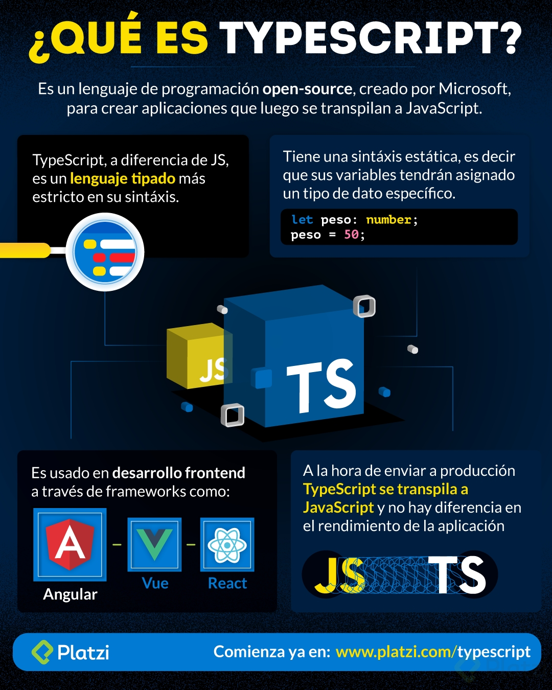

## Clases del Curso de TypeScript con Angular por Belatrix

### ¿Qué es Typescript?

TypeScript es un lenguaje fuertemente tipado creado por Microsoft, aunque está muy relacionado con el framework Angular, TypeScript es un lenguaje independiente que puedes usar para proyectos de back-end con Express o Front-end ya sea con Vue, React o Angular. Para que TypeScript pueda correr en el navegador debe ser transpilado a JavaScript con herramientas como Babel.

VS ESLint tslint plugins

----------------

### Types, Type Inference y Type keyword

A diferencia de JavaScript, TypeScript es un lenguaje fuertemente tipado. Mientras que en JavaScript declaramos una constante de la siguiente manera:

const a = 'hola'

En TypeScript utilizando el carácter ‘:’ le asignamos un tipo de dato a la variable :

const a: string = 'hola'

En caso de que no le asignemos un tipo de dato a la variable, TypeScript automáticamente le va a asignar un tipo de dato, esto es el Type Inference.

Si le asignamos el tipo de dato any a una variable, esta variable va a poder almacenar cualquier tipo de dato, similar a JavaScript Vainilla.

Dentro de TypeScript contamos con la palabra reservada type que nos va a ser de utilidad cuando hagamos nuestros propios tipos de datos.

### Clases

Dentro de TypeScript podemos realizar programación orientada a objetos y como su nombre lo dice vamos a programar objetos, pero para generar dichos objetos primero debemos crear su plantilla base que recibe el nombre de clase.

Una clase está integrada por propiedades y funciones, estas pueden ser privadas, públicas o protected.

A la variable que le asignamos el valor de un objeto debemos indicarle que su tipo de dato es igual a la clase.

Una característica de la programación orientada a objetos es que podemos crear clases padre que hereden sus propiedades y funciones a una clase hijo, esto es la herencia y dentro de TypeScript se representa con la palabra extends.

### Interfaces

Una interfaz es un tipo abstracto que sirve como contrato para la estructura de un objeto y al igual que las clases puede ser utilizada como un tipo de dato. Para declarar una interfaz en TypeScript utilizamos la palabra clave interface.

Dentro de las interfaces en TypeScript podemos manejar propiedades opcionales añadiendo el signo de pregunta ‘?’ al final del nombre de la propiedad.

### Shapes

Cada uno de los tipos tiene una forma o estructura en que es representado, esto es mediante sus propiedades. Dentro de TypeScript si dos variables poseen propiedades idénticas aunque sean de distintas interfaces o clases, estas pueden ser asignadas entre sí.
